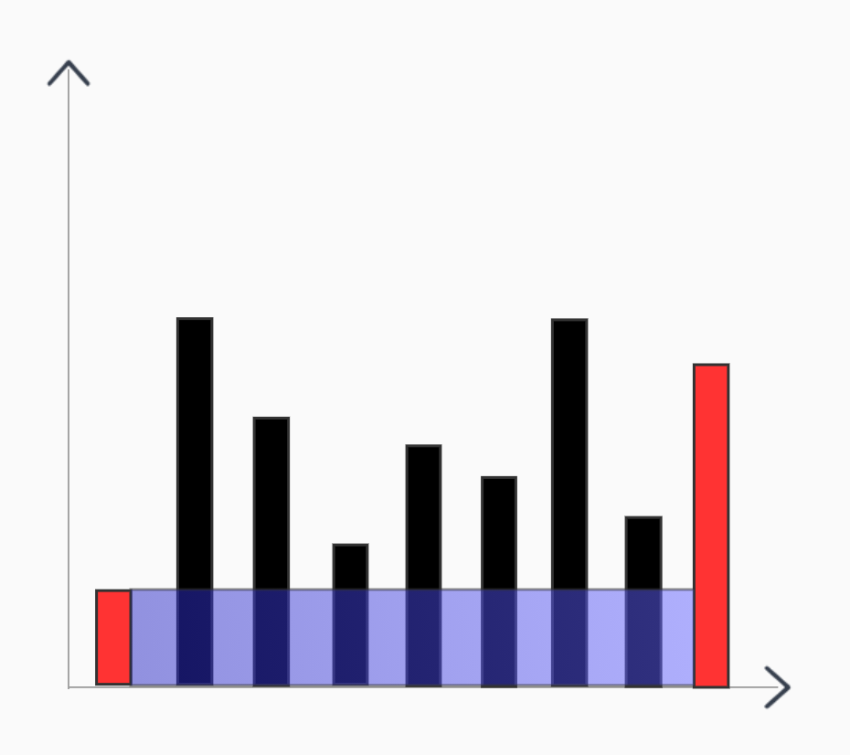
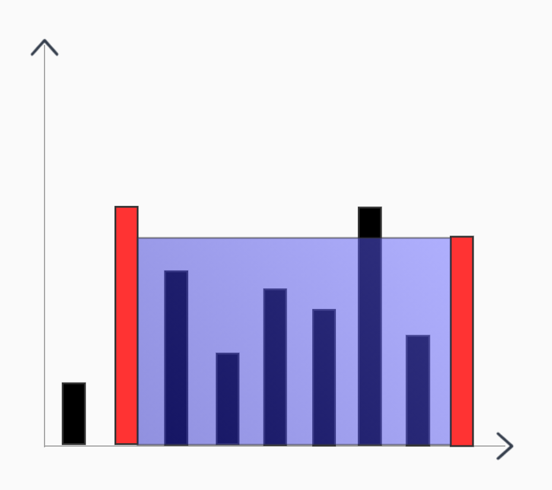
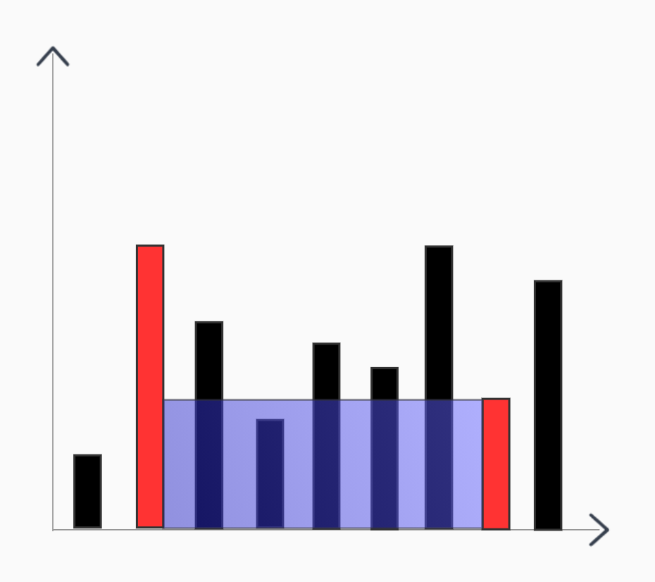
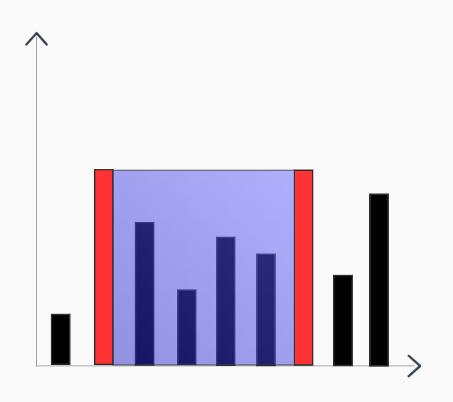
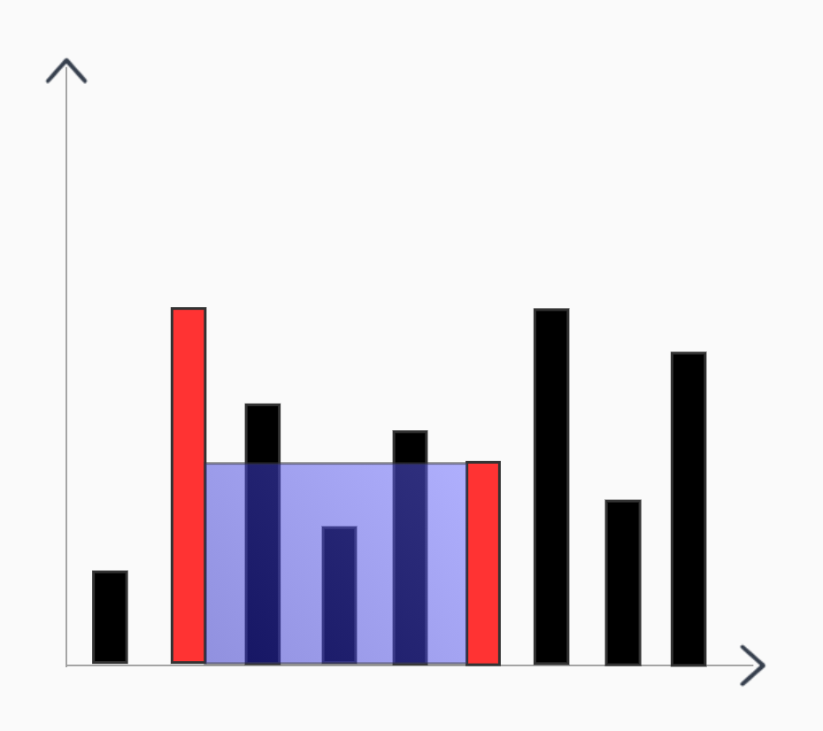
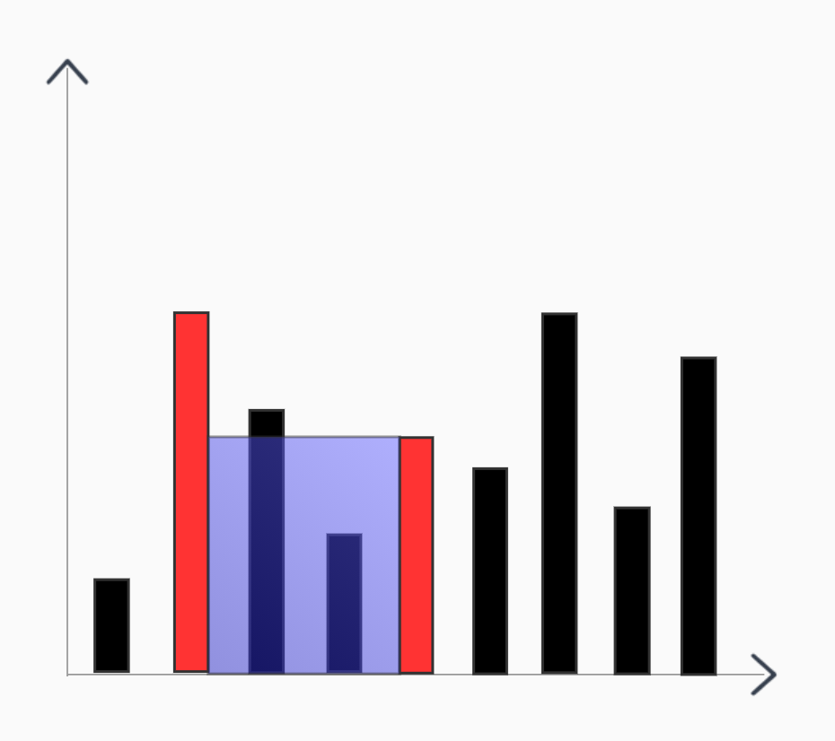
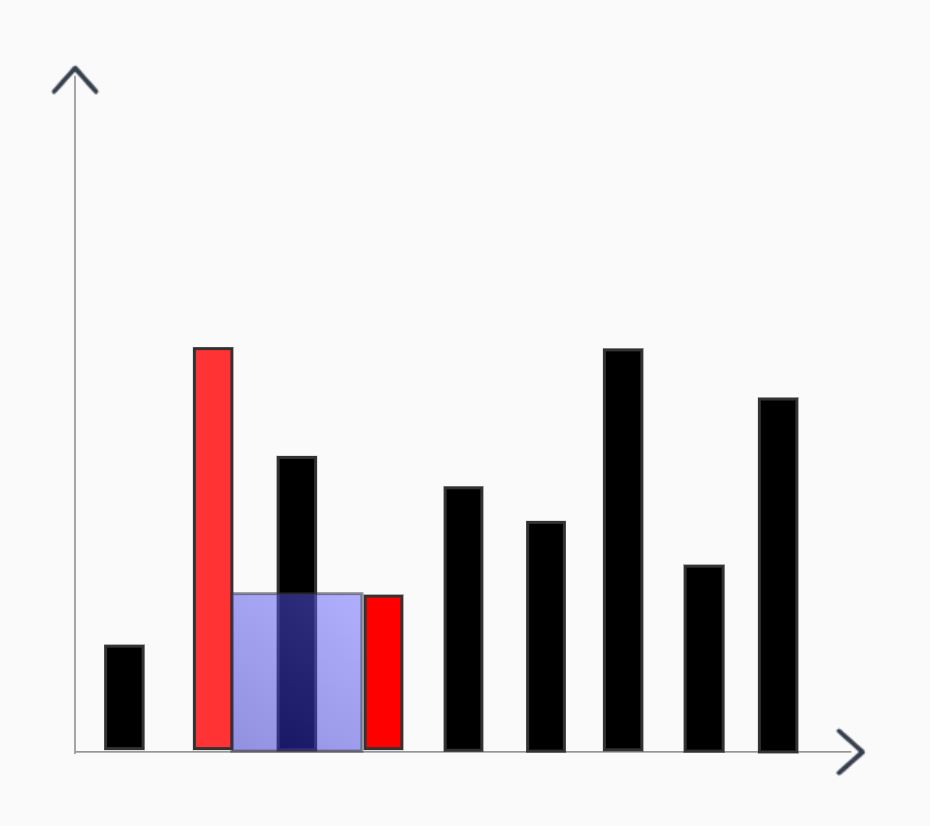
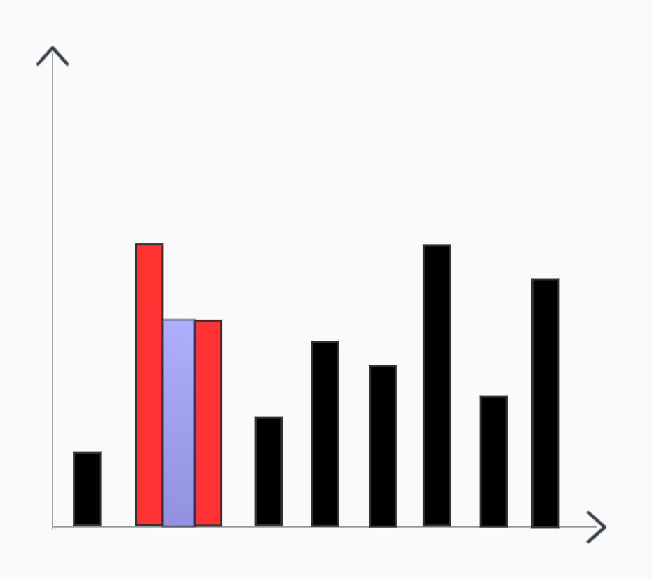

# <center>leetcode problem 11. 盛最多水的容器</center>

## 链接

https://leetcode-cn.com/problems/container-with-most-water/


## 题目描述

给你 n 个非负整数 a1，a2，...，an，每个数代表坐标中的一个点 (i, ai) 。在坐标内画 n 条垂直线，垂直线 i 的两个端点分别为 (i, ai) 和 (i, 0) 。找出其中的两条线，使得它们与 x 轴共同构成的容器可以容纳最多的水。

说明：你不能倾斜容器。

 

示例 1：


输入：[1,8,6,2,5,4,8,3,7]
输出：49 
解释：图中垂直线代表输入数组 [1,8,6,2,5,4,8,3,7]。在此情况下，容器能够容纳水（表示为蓝色部分）的最大值为 49。
示例 2：

输入：height = [1,1]
输出：1
示例 3：

输入：height = [4,3,2,1,4]
输出：16
示例 4：

输入：height = [1,2,1]
输出：2


提示：

n = height.length
2 <= n <= 3 * 104
0 <= height[i] <= 3 * 104


## 解法

### 1.

使用2个下标索引分别为头和尾，从头尾向中心递进，假设一开始最大的面积是在头尾2个索引处，由于面积的高度是由短板来定义的，横向的长度在一开始已经是最大的了，所以之后为了寻找更大的面积，只能缩小横向的宽度，寄希望在纵向上有更高的高度，由当前2个索引中高度较低的那侧向较高的那侧靠近，来找到更高的高度，弥补宽度减少的损失，从而获得更大的面积。

















#### 代码

```c++
class Solution 
{
public:
    int MaxArea(const std::vector<int>& height)
    {
        if (height.size() == 0)
        {
            return 0;
        }

        int max_area = 0;
        int left = 0;
        int right = height.size() - 1;

        while (left < right)
        {
            int temp_area = std::min(height[left], height[right]) * (right - left);
            max_area = std::max(max_area, temp_area);

            if (height[left] < height[right])
            {
                ++left;
            }
            else
            {
                --right;
            }
        }

        return max_area;
    }
};
```

