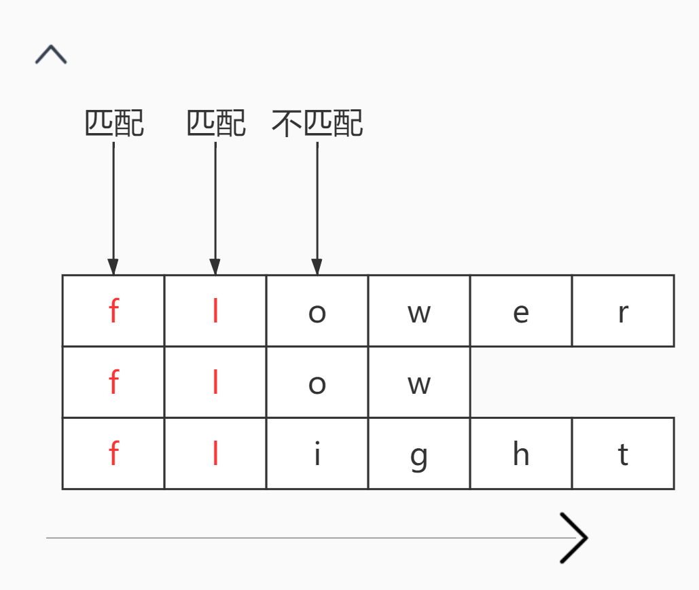
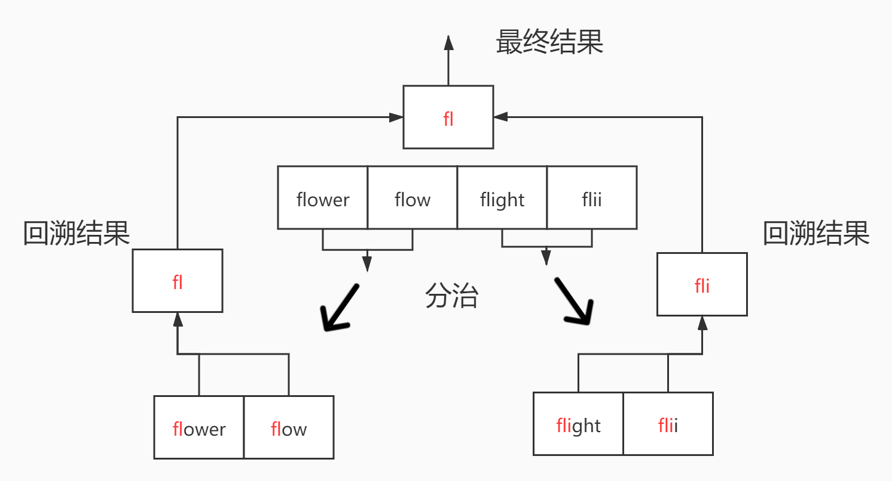
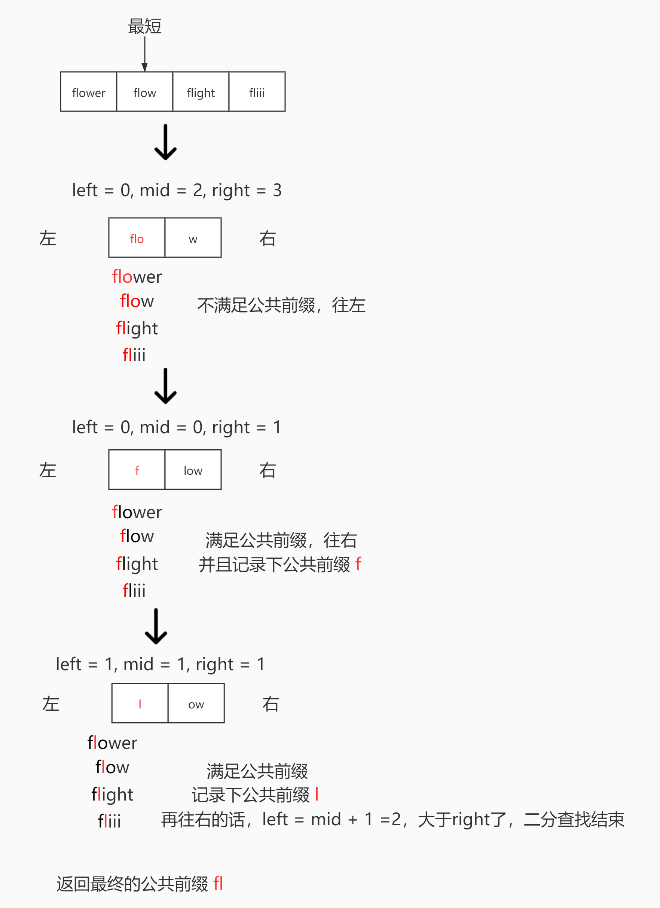

# <center>leetcode problem 14. 最长公共前缀</center>

## 链接

https://leetcode-cn.com/problems/longest-common-prefix/


## 题目描述

编写一个函数来查找字符串数组中的最长公共前缀。

如果不存在公共前缀，返回空字符串 \"\"。

 

示例 1：

输入：strs = [\"flower\",\"flow\",\"flight\"]
输出：\"fl\"
示例 2：

输入：strs = [\"dog\",\"racecar\",\"car\"]
输出：\"\"
解释：输入不存在公共前缀。


提示：

0 <= strs.length <= 200
0 <= strs[i].length <= 200
strs[i] 仅由小写英文字母组成


## 解法

### 1.

遍历字符串数组，纵向比较每一个字符串的字符，如果字符都相同，存入结果中，如果已达到某个字符串的末尾或者任意一个字符不相同，结束遍历，返回结果。



#### 代码

```c++
class Solution 
{
public:
    std::string LongestCommonPrefix(const std::vector<std::string>& strs)
    {
        if (strs.size() == 0)
        {
            return "";
        }

        std::string result;
        size_t length = strs[0].size();

        for (size_t i = 0; i < length; ++i)
        {
            char c = strs[0][i];
            for (size_t j = 1; j < strs.size(); ++j)
            {
                if (i >= strs[j].size() || strs[j][i] != c)
                {
                    return result;
                }
            }

            result += c;
        }

        return result;
    }
};
```

### 2.

使用分治法，将大的问题分解为一个一个的小问题，问题的最小规模为2个字符串求公共前缀，小问题的结果作为之前较大问题的条件参数进行回溯，从而得到最开始的最大问题的结果。



#### 代码

```c++
class Solution 
{
public:
    std::string LongestCommonPrefix(const std::vector<std::string>& strs)
    {
        if (strs.size() == 0)
        {
            return "";
        }

        return this->DivideConquer(strs, 0, strs.size() - 1);
    }

private:
    std::string DivideConquer(const std::vector<std::string>& strs, const int left, const int right)
    {
        if (right - left <= 1)
        {
            return this->CommonPrefix(strs[left], strs[right]);
        }

        int mid = (left + right) / 2;
        std::string left_result = this->DivideConquer(strs, left, mid);
        std::string right_result = this->DivideConquer(strs, mid + 1, right);

        return this->CommonPrefix(left_result, right_result);
    }

    std::string CommonPrefix(const std::string& str1, const std::string& str2)
    {
        std::string result;

        for (size_t i = 0; i < str1.size(); ++i)
        {
            char c = str1[i];

            if (i >= str2.size() || c != str2[i])
            {
                return result;
            }

            result += c;
        }

        return result;
    }
};
```

### 3.

使用二分查找的方法，首先找出字符串数组中最短的字符，因为最大公共前缀的长度至多就是整个最短字符串的长度。对整个最短字符串的长度做二分查找，分为左半部分和右半部分，然后对左半部分做遍历，看左半部分是否为一个公共前缀，如果是公共前缀，保存部分结果，并将下次二分查找的区间定位到右半区，因为左半部分的公共前缀肯定是小于等于整个公共前缀的，即右半部分可能还有公共前缀的一部分。如果左半部分不是公共前缀，将下次二分查找的区间定位到左半区，公共前缀肯定存在于更靠左的位置，因为公共前缀都是从左往右的。根据这个规则持续进行二分查找，直到遍历结束，得出结果。



#### 代码

```c++
class Solution 
{
public:	
    std::string LongestCommonPrefix(const std::vector<std::string>& strs)
    {
        if (strs.size() == 0)
        {
            return "";
        }

        int min_length = INT_MAX;
        int min_index = 0;
        for (size_t i = 0; i < strs.size(); ++i)
        {
            if (strs[i].size() < min_length)
            {
                min_length = strs[i].size();
                min_index = i;
            }
        }

        int left = 0;
        int right = min_length - 1;
        std::string result;

        while (left <= right)
        {
            int mid = (left + right) / 2;
            bool match = true;

            for (size_t i = 0; i < strs.size(); ++i)
            {
                for (int j = left; j <= mid; ++j)
                {
                    if (strs[min_index][j] != strs[i][j])
                    {
                        match = false;
                        break;
                    }
                }

                if (!match)
                {
                    break;
                }
            }

            if (match)
            {
                result += strs[min_index].substr(left, mid - left + 1);
                left = mid + 1;
            }
            else
            {
                right = mid - 1;
            }
        }

        return result;
    }
};
```

