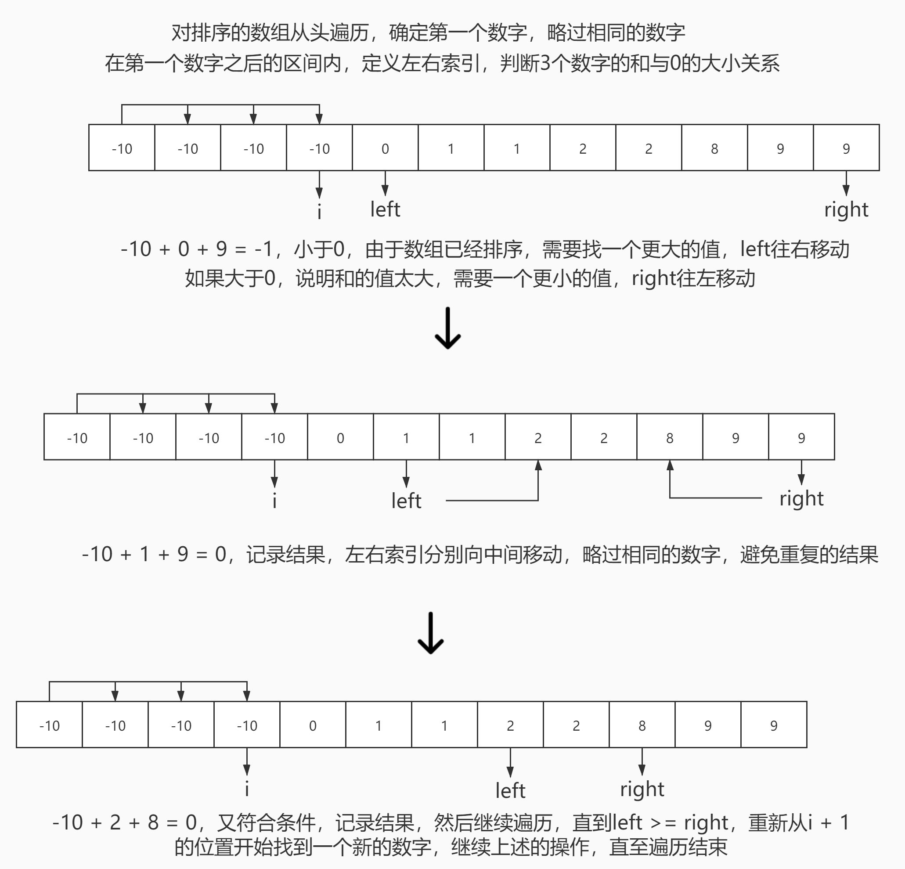

# <center>leetcode problem 15. 三数之和</center>

## 链接

https://leetcode-cn.com/problems/3sum/


## 题目描述

给你一个包含 n 个整数的数组 nums，判断 nums 中是否存在三个元素 a，b，c ，使得 a + b + c = 0 ？请你找出所有和为 0 且不重复的三元组。

注意：答案中不可以包含重复的三元组。

 

示例 1：

输入：nums = [-1,0,1,2,-1,-4]
输出：[[-1,-1,2],[-1,0,1]]
示例 2：

输入：nums = []
输出：[]
示例 3：

输入：nums = [0]
输出：[]


提示：

0 <= nums.length <= 3000
-105 <= nums[i] <= 105


## 解法

### 1.

排序数组，进行遍历，固定住一个数字，在其后的区间内，使用2个索引，分别从头尾开始向中间遍历，计算这3个数字的和，如果为0则保存结果，如果不为0，根据是正数还是负数判断下一次递进的方向。由于数组是排序好的，如果三个数的和小于0，说明值太小了，左边的索引向右递进，获取更大的和，如果三个数的和大于0，说明值太大了，右边的索引向左递进，获取更小的和，得到和为0的结果时，需要将左右的索引分别递进去掉重复的数，防止重复的结果，同时外层循环中的那个数也需要去除相同的数字，防止重复计算结果。



#### 代码

```c++
class Solution {
public:
    std::vector<std::vector<int> > ThreeSum(std::vector<int>& nums) 
    {
        std::vector<std::vector<int> > result;

        if (nums.size() < 3)
        {
            return result;
        }

        std::sort(nums.begin(), nums.end());

        for (size_t i = 0; i < nums.size(); ++i)
        {
            if (i > 0 && nums[i] == nums[i - 1])
            {
                continue;
            }

            // 第一个数大于0，由于数组都是排好序的，后面数肯定都是正数
            // 正数相加无法得到0，直接结束循环
            if (nums[i] > 0)
            {
                break;
            }

            int left = i + 1;
            int right = nums.size() - 1;

            while (left < right)
            {
                int sum = nums[i] + nums[left] + nums[right];

                if (sum < 0)
                {
                    ++left;
                }
                else if (sum > 0)
                {
                    --right;
                }
                else
                {
                    std::vector<int> temp_vec;
                    temp_vec.emplace_back(nums[i]);
                    temp_vec.emplace_back(nums[left]);
                    temp_vec.emplace_back(nums[right]);
                    result.push_back(temp_vec);

                    while (left + 1 < nums.size() && nums[left] == nums[left + 1])
                    {
                        ++left;
                    }

                    while (right - 1 >= 0 && nums[right] == nums[right - 1])
                    {
                        --right;
                    }

                    ++left;
                    --right;
                }
            }
        }

        return result;
    }
};
```

