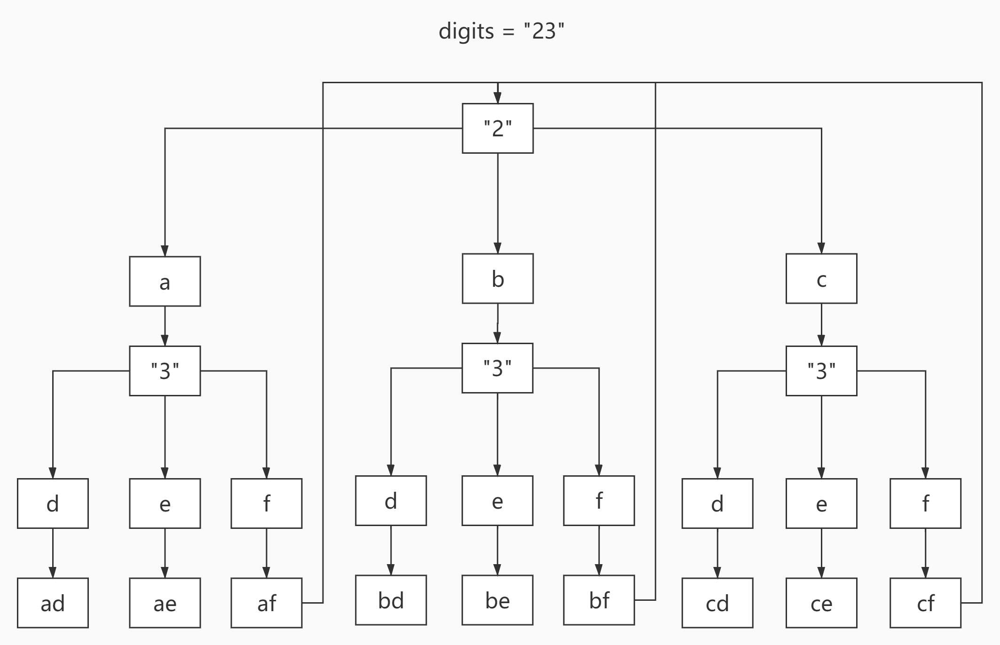

# <center>leetcode problem 17. 电话号码的字母组合</center>

 ## 链接

https://leetcode-cn.com/problems/letter-combinations-of-a-phone-number/


## 题目描述

给定一个仅包含数字 2-9 的字符串，返回所有它能表示的字母组合。答案可以按 任意顺序 返回。

给出数字到字母的映射如下（与电话按键相同）。注意 1 不对应任何字母。


示例 1：

输入：digits = \"23\"
输出：[\"ad\",\"ae\",\"af\",\"bd\",\"be\",\"bf\",\"cd\",\"ce\",\"cf\"]
示例 2：

输入：digits = \"\"
输出：[]
示例 3：

输入：digits = \"2\"
输出：[\"a\",\"b\",\"c\"]


提示：

0 <= digits.length <= 4
digits[i] 是范围 [\'2\', \'9\'] 的一个数字。


## 解法

### 1.

求组合结果，很典型的使用递归回溯方法的问题。



#### 代码

```c++
class Solution 
{
public:
    std::vector<std::string> LetterCombinations(const std::string& digits)
    {
        std::vector<std::string> results;

        if (digits.size() == 0)
        {
            return results;
        }

        data_[2] = "abc";
        data_[3] = "def";
        data_[4] = "ghi";
        data_[5] = "jkl";
        data_[6] = "mno";
        data_[7] = "pqrs";
        data_[8] = "tuv";
        data_[9] = "wxyz";

        this->Combine(digits, 0, "", results);

        return results;
    }

private:
    void Combine(const std::string& digits, const uint32_t index, const std::string& combine_str, std::vector<std::string>& results)
    {
        int number = digits[index] - '0';

        for (size_t i = 0; i < data_[number].size(); ++i)
        {
            if (index == digits.size() - 1)
            {
                results.push_back(combine_str + data_[number][i]);
            }
            else
            {
                this->Combine(digits, index + 1, combine_str + data_[number][i], results);
            }
        }
    }

    private:
    std::string data_[10];
};
```


