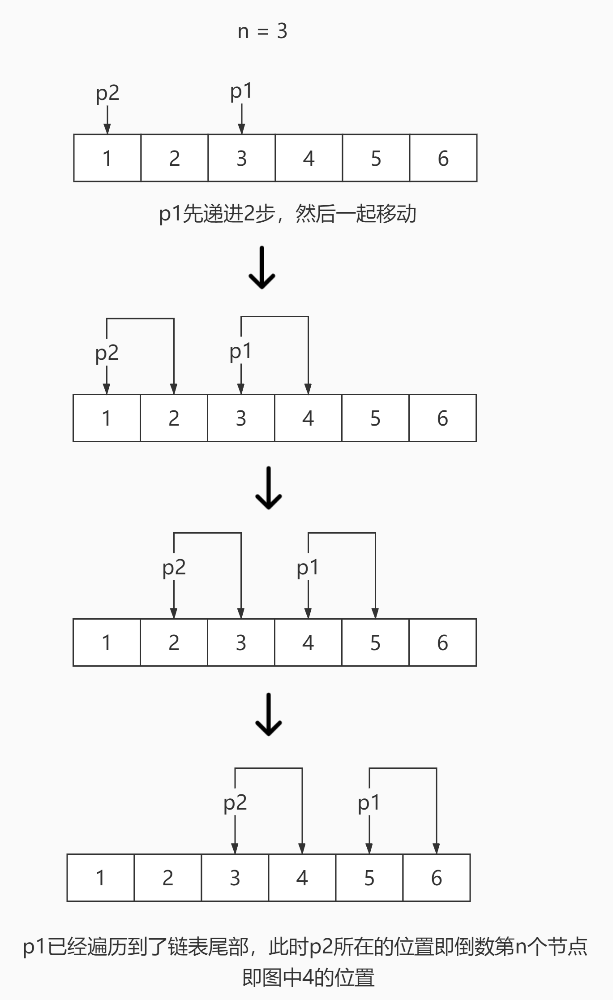

# <center>leetcode problem 19. 删除链表的倒数第 N 个结点</center>

## 链接

https://leetcode-cn.com/problems/remove-nth-node-from-end-of-list/


## 题目描述

给你一个链表，删除链表的倒数第 n 个结点，并且返回链表的头结点。

进阶：你能尝试使用一趟扫描实现吗？

 

示例 1：


输入：head = [1,2,3,4,5], n = 2
输出：[1,2,3,5]
示例 2：

输入：head = [1], n = 1
输出：[]
示例 3：

输入：head = [1,2], n = 1
输出：[1]


提示：

链表中结点的数目为 sz
1 <= sz <= 30
0 <= Node.val <= 100
1 <= n <= sz


## 解法

### 1.

先遍历一次计算链表的长度，然后再遍历一次找到那个节点进行删除。

#### 代码

```c++
struct ListNode 
{
    int val;
    ListNode* next;

    ListNode(int x) 
        : val(x), 
        next(NULL) 
    {
    }
};

class Solution 
{
public:
    ListNode* RemoveNthFromEnd(ListNode* head, int n) 
    {
        ListNode* temp = head;
        int num = 0;

        while (temp)
        {
            ++num;
            temp = temp->next;
        }

        if (num == n)
        {
            head = head->next;
        }
        else
        {
            num -= n;
            temp = head;

            while (temp)
            {
                if (--num <= 0)
                {
                    temp->next = temp->next->next;
                    break;
                }
                else
                {
                    temp = temp->next;
                }
            }
        }

        return head;
    }
};
```

### 2.

递归解法，先遍历到尾节点，然后减少n的值，并且开始返回，当n为0时，将当前节点的下一个节点作为当前节点返回给上一层调用，从而达到删除该节点的目的。

#### 代码

```c++
struct ListNode 
{
    int val;
    ListNode* next;

    ListNode(int x) 
        : val(x), 
        next(NULL) 
    {
    }
};

class Solution 
{
public:
    ListNode* RemoveNthFromEnd(ListNode* head, int n)
    {
        num_ = n;

        return this->Recursive(head);
    }

private:
    ListNode* Recursive(ListNode* head)
    {
        ListNode* temp = NULL;

        if (head->next)
        {
            temp = this->Recursive(head->next);
        }

        if (--num_ == 0)
        {
            head = temp;
        }
        else
        {
            head->next = temp;
        }

        return head;
    }

    int num_;
};
```

### 3.

使用快慢两个指针只进行一次遍历，其中一个是一级指针，一个是二级指针，根据n的大小，先将一级指针递进n-1次，之后双指针一起递进移动，在一级指针移动到尾端之后，二级指针此时指向的即为倒数第n个节点，直接将其之后的节点赋值给二级指针的解引用，完成删除节点，使用二级指针是因为不需要保存前一个节点的指针，直接获取指针的地址，对地址的解引用进行赋值就相当于替换了该指针。



#### 代码

```c++
struct ListNode 
{
    int val;
    ListNode* next;

    ListNode(int x) 
        : val(x), 
        next(NULL) 
    {
    }
};

class Solution 
{
public:
    ListNode* RemoveNthFromEnd(ListNode* head, int n)
    {
        ListNode** p = &head;
        ListNode* temp = head;
        int count = n - 1;

        while (temp->next)
        {
            if (count <= 0)
            {
                p = &((*p)->next);
            }
            else
            {
                --count;
            }

            temp = temp->next;
        }

        (*p) = (*p)->next;

        return head;
    }
};
```

