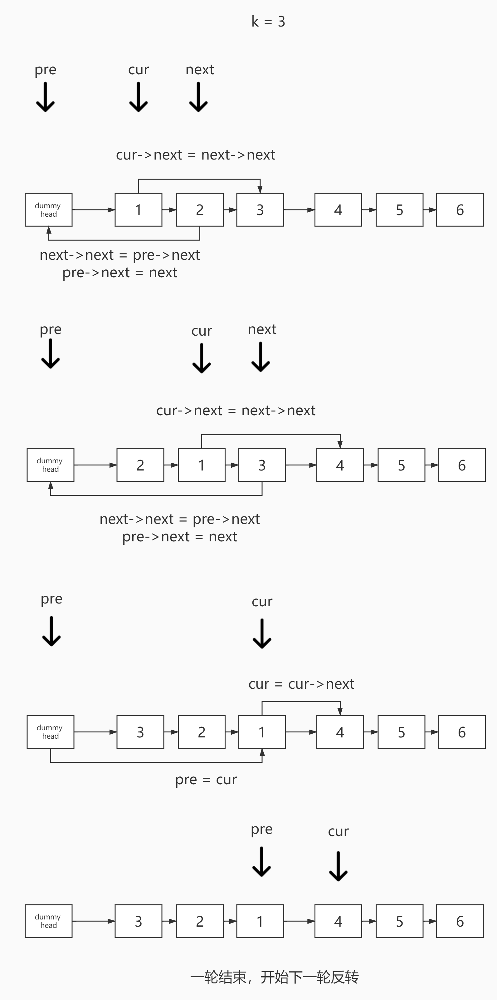

# <center>leetcode problem 25. K 个一组翻转链表</center>

## 链接

https://leetcode-cn.com/problems/reverse-nodes-in-k-group/


## 题目描述

给你一个链表，每 k 个节点一组进行翻转，请你返回翻转后的链表。

k 是一个正整数，它的值小于或等于链表的长度。

如果节点总数不是 k 的整数倍，那么请将最后剩余的节点保持原有顺序。

进阶：

你可以设计一个只使用常数额外空间的算法来解决此问题吗？
你不能只是单纯的改变节点内部的值，而是需要实际进行节点交换。

示例 1：


输入：head = \[1,2,3,4,5\], k = 2
输出：\[2,1,4,3,5\]
示例 2：


输入：head = \[1,2,3,4,5\], k = 3
输出：\[3,2,1,4,5\]
示例 3：

输入：head = \[1,2,3,4,5\], k = 1
输出：\[1,2,3,4,5\]
示例 4：

输入：head = \[1\], k = 1
输出：\[1\]
提示：

列表中节点的数量在范围 sz 内
1 <= sz <= 5000
0 <= Node.val <= 1000
1 <= k <= sz


## 解法

### 1.

使用一个多余的头指针来保存最终的结果，使用一个pre指针来辅助处理连续k个节点交换顺序。遍历链表，使用计数变量，在遍历每k个节点之后，保存尾节点的next指针，倒置该k个节点的顺序，将原来的头节点，即现在的尾节点的next设置为之前保存的next，将原来的尾节点，即现在的头节点放在pre指针的next域，即完成k个节点的交换顺序，并将倒序后的节点重新接入已有的链表中。

#### 代码

```c++
struct ListNode 
{
    ListNode(int x) 
        : val(x), 
        next(NULL) 
    {
    }

    int val;
    ListNode* next;
};

class Solution 
{
public:
    ListNode* ReverseKGroup(ListNode* head, int k)
    {
        ListNode* n = new ListNode(-1);
        n->next = head;
        ListNode* pre = n;
        ListNode* cur = head;
        int count = 0;

        while (cur)
        {
            ++count;
            if (count == k)
            {
                // 此处cur为k个节点中的尾节点，保存next
                ListNode* next = cur->next;
                cur->next = NULL;
                // 此处first为k个节点中的头节点
                ListNode* first = pre->next;
                // 倒置顺序
                this->ReverseNode(first);
                // 此处的first已经变为尾节点，将保存的next赋值给其next域
                first->next = next;
                // 此处的cur已经变为头节点，将其赋值给pre的next域
                pre->next = cur;

                // 当前的尾节点作为下一轮k个节点的pre节点
                pre = first;
                cur = pre->next;
                count = 0;
            }
            else
            {
                cur = cur->next;
            }
        }

        return n->next;
    }

private:
    ListNode* ReverseNode(ListNode* node)
    {
        if (node->next == NULL)
        {
            return node;
        }

        ListNode* cur_node = this->ReverseNode(node->next);
        cur_node->next = node;
        node->next = NULL;

        return node;
    }
};
```

### 2.

与第一个方法使用相同的思路，只不过将中间倒序链表的方式从递归改成了遍历。



#### 代码

```c++
struct ListNode 
{
    ListNode(int x) 
        : val(x), 
        next(NULL) 
    {
    }

    int val;
    ListNode* next;
};

class Solution 
{
public:
    ListNode* ReverseKGroup(ListNode* head, int k)
    {
        ListNode* n = new ListNode(-1);
        n->next = head;
        ListNode* pre = n;
        ListNode* cur = head;
        int count = 0;

        while (cur)
        {
            ++count;
            cur = cur->next;
        }

        cur = head;
        while (count >= k)
        {
            for (int i = 1; i < k; ++i)
            {
                // 这里的cur永远是k个节点中的第一个节点
                // 整个循环不断把cur往后移
                // cur的next即下一个要调到头部的节点
                ListNode* next = cur->next;
                // cur的next变成后面隔一个节点
                cur->next = next->next;
                // next即将被放在k个节点的头部，将当前的头部节点当作自己的next
                next->next = pre->next;
                // 将next放在k个节点的第一个位置上
                pre->next = next;
            }

            // 下一轮
            pre = cur;
            cur = pre->next;

            count -= k;
        }

        return n->next;
    }
};
```

