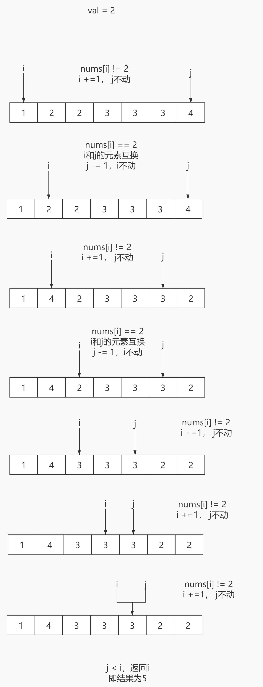

# <center>leetcode problem 27. 移除元素</center>

## 链接

https://leetcode-cn.com/problems/remove-element/


## 题目描述

给你一个数组 nums 和一个值 val，你需要 原地 移除所有数值等于 val 的元素，并返回移除后数组的新长度。

不要使用额外的数组空间，你必须仅使用 O(1) 额外空间并 原地 修改输入数组。

元素的顺序可以改变。你不需要考虑数组中超出新长度后面的元素。

 

说明:

为什么返回数值是整数，但输出的答案是数组呢?

请注意，输入数组是以「引用」方式传递的，这意味着在函数里修改输入数组对于调用者是可见的。

你可以想象内部操作如下:

// nums 是以“引用”方式传递的。也就是说，不对实参作任何拷贝
int len = removeElement(nums, val);

// 在函数里修改输入数组对于调用者是可见的。
// 根据你的函数返回的长度, 它会打印出数组中 该长度范围内 的所有元素。
for (int i = 0; i < len; i++) {
    print(nums\[i\]);
}


示例 1：

输入：nums = \[3,2,2,3\], val = 3
输出：2, nums = \[2,2\]
解释：函数应该返回新的长度 2, 并且 nums 中的前两个元素均为 2。你不需要考虑数组中超出新长度后面的元素。例如，函数返回的新长度为 2 ，而 nums = \[2,2,3,3\] 或 nums = \[2,2,0,0\]，也会被视作正确答案。
示例 2：

输入：nums = \[0,1,2,2,3,0,4,2\], val = 2
输出：5, nums = \[0,1,4,0,3\]
解释：函数应该返回新的长度 5, 并且 nums 中的前五个元素为 0, 1, 3, 0, 4。注意这五个元素可为任意顺序。你不需要考虑数组中超出新长度后面的元素。


提示：

0 <= nums.length <= 100
0 <= nums\[i\] <= 50
0 <= val <= 100


## 解法

### 1.

使用双指针的方法，固定一个指针索引不动，用另一个索引去遍历数组，判断是否与目标值相同，不相同才将值更新到第一个指针索引的位置，否则略过，与

[删除有序数组中的重复项](https://guicaisa.github.io/posts/c2bb7b8b.html)类似。

#### 代码

```c++
class Solution 
{
public:
	int RemoveElement(std::vector<int>& nums, int val) 
	{
		int i = 0;

		for (int j = 0; j < nums.size(); ++j)
		{
			if (nums[j] != val)
			{
				nums[i] = nums[j];
				++i;
			}
		}

		return i;
	}
};

```

### 2.

另一种双指针的方法，第一个指针从头遍历，第二个指针先定位在数组的末尾处，遇到与目标值相同的数字第一个指针不动，与第二个指针的元素互换位置，第二个指针向左移动，遇到与目标值不同的数字第一个指针继续向右移动，第二个指针不动，实际上就是将与目标值相同的数字全部移动到数组的末尾处，题目中没有要求数组需要排序，所以置换的结果的顺序并不重要。



#### 代码

```c++
class Solution 
{
public:	
	int RemoveElement(std::vector<int>& nums, int val)
	{
		if (nums.size() == 0)
		{
			return 0;
		}

		int i = 0;
		int j = nums.size() - 1;
		for (; i < nums.size() && j >= i; )
		{
			if (nums[i] == val)
			{
				int temp = nums[j];
				nums[j] = nums[i];
				nums[i] = temp;
				--j;
			}
			else
			{
				++i;
			}
		}

		return i;
	}
};
```

