# <center>leetcode problem 28. 实现 strStr()</center>

## 链接

https://leetcode-cn.com/problems/implement-strstr/


## 题目描述


实现 [strStr()](https://baike.baidu.com/item/strstr/811469) 函数。

给你两个字符串 `haystack` 和 `needle` ，请你在 `haystack` 字符串中找出 `needle` 字符串出现的第一个位置（下标从 0 开始）。如果不存在，则返回 `-1` 。

 

**说明：**

当 `needle` 是空字符串时，我们应当返回什么值呢？这是一个在面试中很好的问题。

对于本题而言，当 `needle` 是空字符串时我们应当返回 0 。这与 C 语言的 [strstr()](https://baike.baidu.com/item/strstr/811469) 以及 Java 的 [indexOf()](https://docs.oracle.com/javase/7/docs/api/java/lang/String.html#indexOf(java.lang.String)) 定义相符。

 

**示例 1：**

```
输入：haystack = \"hello\", needle = \"ll\"
输出：2
```

**示例 2：**

```
输入：haystack = \"aaaaa\", needle = \"bba\"
输出：-1
```

**示例 3：**

```
输入：haystack = \"\", needle = \"\"
输出：0
```

 

**提示：**

- `0 <= haystack.length, needle.length <= 5 * 104`
- `haystack` 和 `needle` 仅由小写英文字符组成


## 解法

### 1.

暴力求解法，遍历字符串，逐个字符当作子串的开始，与匹配串进行判断。

#### 代码

```c++
class Solution 
{
public:
    int StrStr(const std::string& haystack, const std::string& needle) 
    {
        if (needle.size() == 0)
        {
            return 0;
        }

        size_t size = haystack.size();
        size_t n_size = needle.size();

        for (size_t i = 0; i < size && size - i >= n_size; ++i)
        {
            if (haystack[i] == needle[0])
            {
                for (size_t j = i, k = 0; j < size && k < n_size; ++j, ++k)
                {
                    if (haystack[j] == needle[k])
                    {
                        if (k == n_size - 1)
                        {
                            return i;
                        }
                    }
                    else
                    {
                        break;
                    }
                }
            }
        }

        return -1;
    }
};
```

### 2.

使用kmp算法，根据已匹配的子串的最长公共前缀后缀长度，将搜索字符串的索引定位到合理的位置，即相同公共前缀后缀的第一位，继续进行判断，减少多余的重复判断，提高效率。

举个例子，有一个搜索字符串str=\"ABCDABEEFG\"，一个匹配串p=\"ABCDABH\"。我们先使用暴力求解的方式进行匹配。

第一次匹配：

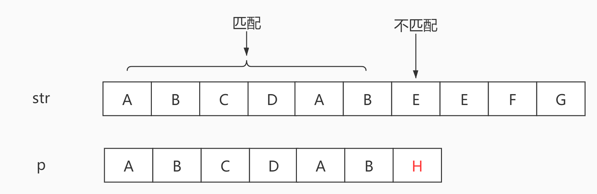

str从索引0开始，与p进行匹配判断，前6个字符匹配，但是第7个字符不匹配，这个时候常规的做法是将str的索引往右移一位，从索引1的位置开始继续下一次匹配判断。

第二次匹配：

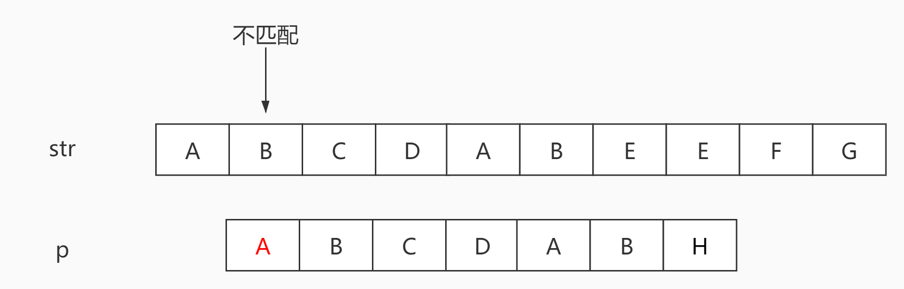

这一次直接第一个字符就不匹配了，接下来后面需要继续递进str的索引，将str中的每一个字符当作子串的起始字符与p进行匹配。这样做的效率很低，kmp算法可以通过计算子串中存在的最长公共前缀后缀的长度，来省略掉部分的匹配操作，从而提升效率。

回到第一次匹配的情况，str与p的前6的字符匹配成功，但是第七个字符匹配失败了，这时候我们观察下前6个字符\"ABCDAB\"，这是已匹配的部分，其中\"AB\"在头尾各出现了1次，我们可以用肉眼得出这个子串的最长公共前缀和后缀的长度为2。通过字符串的公共前缀后缀的性质我们可以得知，前缀的部分在该字符串中任何非公共前缀后缀的位置是无法匹配的，简而言之就是这个已经匹配的子串\"ABCDAB\"，无法在以从\'B\'，\'C\'，\'D\'为开头的字符串形成匹配，所以在第一次匹配结束后，根据已匹配的子串中的公共前缀和后缀的长度，可以直接略过\"ABCDAB\"中的\'B\'，\'C\'，\'D\'三个字符，直接在第二个\'A\'的位置开始下一次的匹配判断，省略掉了中间的匹配判断步骤，提升了效率。

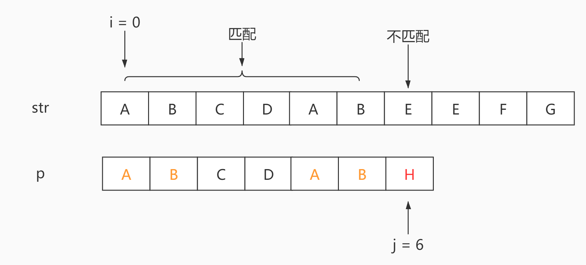

假设第一次匹配的时候str从索引0的位置开始，j为遍历p的索引，第一次匹配了6个字符，i = j = 6的时候，字符产生了不匹配，这时候需要寻找下一次i开始遍历的位置。已知已匹配的子串\"ABCDAB\"最长公共前缀后缀长度为2，下一次起始匹配索引i的位置 = 6 - 2 = 4，即str中第二个\'A\'的位置。

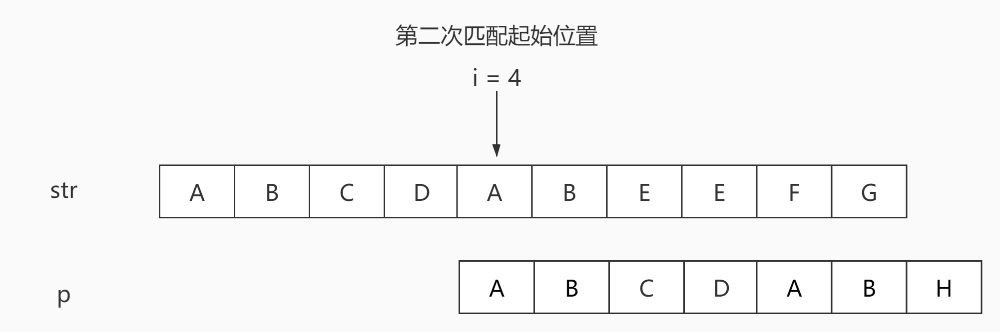

重复这样的操作，直到找到完全匹配的子串，或者没有找到合适的匹配，返回结果。

这种类似动态规划的方式，肯定需要一个状态转移的数据结构，我们需要计算p中所有子串的最长公共前缀后缀的长度，保存在一个数组中。dp\[i\]表示在p字符串中，从第一个字符开始，长度为i+1的子串，所拥有的最长公共前缀后缀的长度。以\"ABCDABEAB\"为例，来看下计算这个dp数组的步骤，i表示索引，len表示公共前缀后缀的长度。

第一个子串\"A\"，公共前缀后缀长度肯定为0:

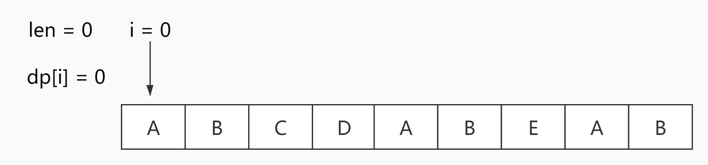

子串\"AB\"：

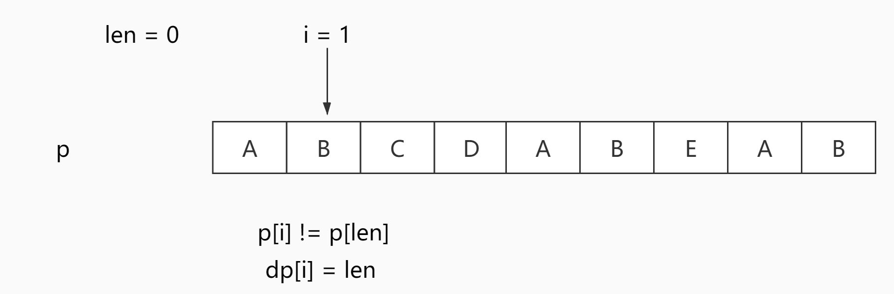

子串\"ABC\"：

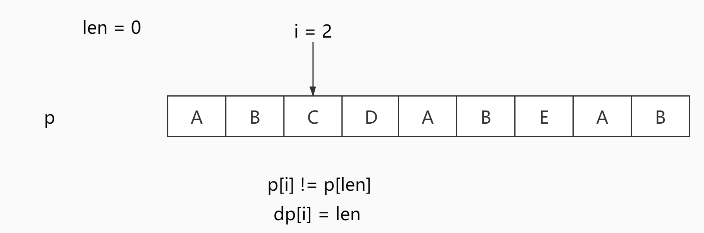

子串\"ABCD\"：

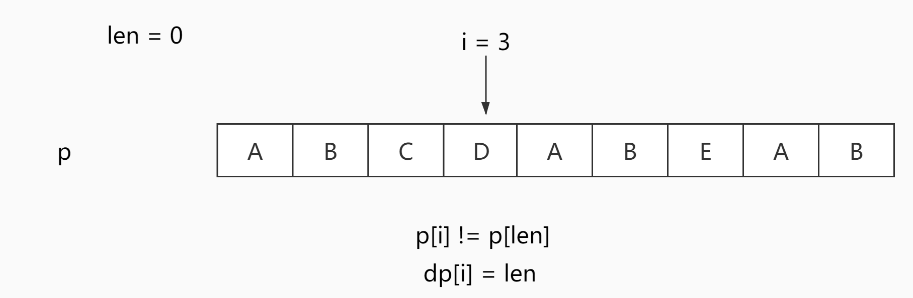

子串\"ABCDA\"：

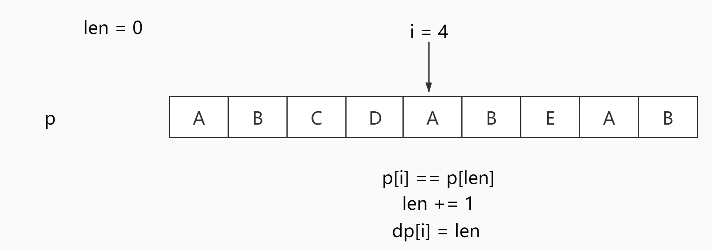

子串\"ABCDAB\"：

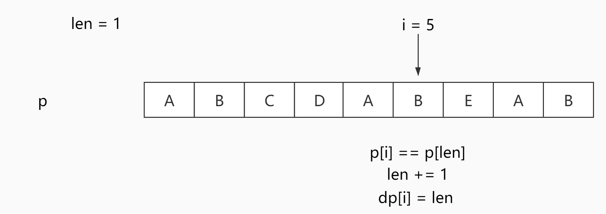

子串\"ABCDABE\"：

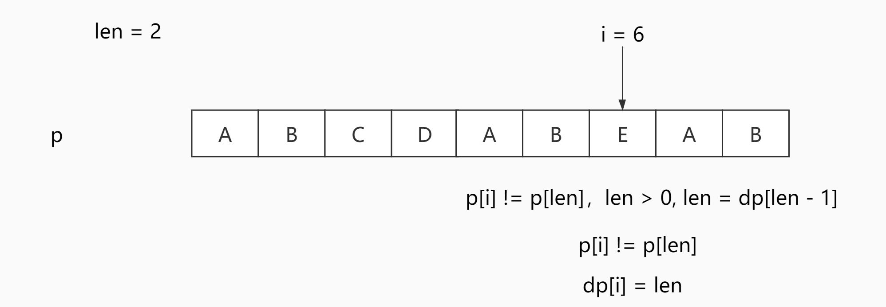

子串\"ABCDABEA\"：

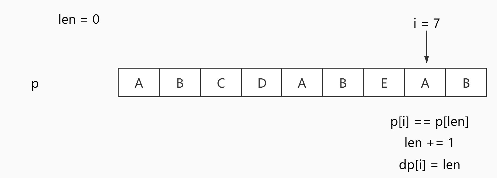

子串\"ABCDABEAB\"：

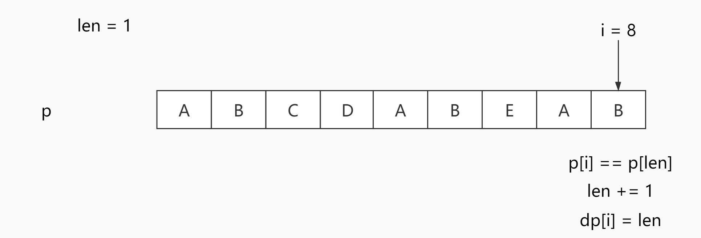

这个例子描述了下面代码里生成dp数组的方法的逻辑，其中len代表了当前的最长公共前缀后缀的长度，其实就是表示了前len个字符，所以在遍历中计算每个子串的公共前缀后缀长度时，需要判断当前字符和前第len个字符的相等关系，如果相等，len可以递增，然后保存到dp中，如果不相同，就需要递减len到0或者直到找到相同的字符。

#### 代码

```c++
class Solution 
{
public:
    int StrStr(const std::string& haystack, const std::string& needle)
    {
        if (needle == "")
        {
            return 0;
        }

        std::vector<int> next(needle.size(), 0);

        this->GenerateKmpNext(needle, next);

        size_t j = 0;

        for (size_t i = 0; i < haystack.size(); ++i)
        {
            if (haystack[i] == needle[j])
            {
                ++j;
                if (j == needle.size())
                {
                    return i - j + 1;
                }
            }
            else
            {
                if (j > 0)
                {
                    i -= (next[j - 1] + 1);
                }
                j = 0;
            }
        }

        return -1;
    }

private:
    void GenerateKmpNext(const std::string& needle, std::vector<int>& next)
    {
        int len = 0;
        next[0] = 0;

        for (size_t i = 1; i < needle.size(); ++i)
        {
            while (len > 0 && needle[len] != needle[i])
            {
                len = next[len - 1];
            }

            if (needle[len] == needle[i])
            {
                ++len;
            }

            next[i] = len;
        }
    }
};
```

