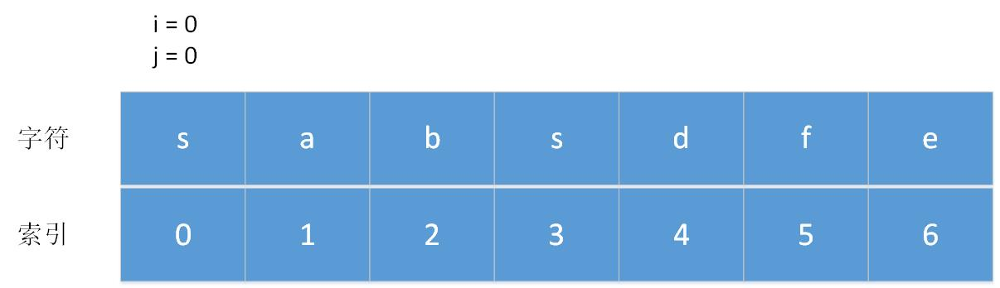
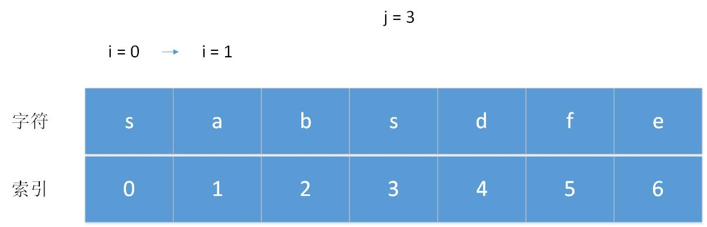

# <center>leetcode problem 3. 无重复字符的最长子串</center>

## 链接

https://leetcode-cn.com/problems/longest-substring-without-repeating-characters/


## 题目描述
给定一个字符串，请你找出其中不含有重复字符的 最长子串 的长度。

 

示例 1:

输入: s = \"abcabcbb\"
输出: 3 
解释: 因为无重复字符的最长子串是 \"abc\"，所以其长度为 3。
示例 2:

输入: s = \"bbbbb\"
输出: 1
解释: 因为无重复字符的最长子串是 \"b\"，所以其长度为 1。
示例 3:

输入: s = \"pwwkew\"
输出: 3
解释: 因为无重复字符的最长子串是 \"wke\"，所以其长度为 3。
     请注意，你的答案必须是 子串 的长度，\"pwke\" 是一个子序列，不是子串。
示例 4:

输入: s = \"\"
输出: 0


提示：

0 <= s.length <= 5 * 104
s 由英文字母、数字、符号和空格组成


## 解法
### 1.
暴力求解，遍历所有可能出现的子串。

#### 代码
```c++
class Solution
{
public:
    int LengthOfLongestSubstring(const std::string& s)
    {
        if (s == "")
        {
            return 0;
        }

        std::unordered_map<char, int> char_to_index;
        int max_length = 1;

        for (size_t i = 0; i < s.size(); )
        {
            if (char_to_index.find(s[i]) == char_to_index.end())
            {
                char_to_index[s[i]] = i;
                ++i;

                if (i == s.size())
                {
                    max_length = char_to_index.size() > max_length ? char_to_index.size() : max_length;
                }
            }
            else
            {
                if (char_to_index.size() > 1)
                {
                    max_length = char_to_index.size() > max_length ? char_to_index.size() : max_length;
                    i = char_to_index[s[i]] + 1;
                    char_to_index.clear();
                }
                else
                {
                    char_to_index[s[i]] = i;
                    ++i;
                }
            }
        }

        return max_length;
    }
};
```

### 2.
使用滑动窗口的方式维持一个不包含重复字符的索引集合，在右边界往右遍历的过程中遇到不重复的字符就进行添加，更新最大子串长度，如果遇到已经出现的重复字符，将左侧边界不停右移，直到去掉重复字符为止。

举例，i，j分别为左右边界，初始都为0，i先不动，j向右移动，每次遇到没出现过的字符就记录在集合中，然后更新长度。



当j行进到索引3的时候，字符为\'s\'，此时左边界i为0，对应的字符也是\'s\'，集合中出现了相同的字符，此时停止移动右边界j，将左边界i向右移动，直到第一个\'s\'的索引位置之后为止，即索引1。



此时集合中重复的字符\'s\'已经被移除，右边界j可以继续向右移动，继续更新长度，直到循环结束，即可得出结果。

#### 代码
```c++
class Solution
{
public:
    int LengthOfLongestSubstring(const std::string& s)
    {
        std::unordered_set<int> char_set;
        int max_length = 0;

        for (size_t i = 0, j = 0; i < s.size() && j < s.size(); )
        {
            if (char_set.find(s[j]) == char_set.end())
            {
                char_set.insert(s[j++]);
                max_length = char_set.size() > max_length ? char_set.size() : max_length;
            }
            else
            {
                char_set.erase(s[i++]);
            }
        }

        return max_length;
    }
};
```


### 3.
滑动窗口的更简易方式，在右边界向右扩展碰到重复的字符时，直接将左边界定位到该字符第一次出现的位置的后一位，省去上一种方法中的多步操作。

#### 代码
```c++
class Solution
{
public:
    int LengthOfLongestSubstring(const std::string& s)
    {
        std::unordered_map<char, int> char_to_index;
        int max_length = 0;

        for (size_t i = 0, j = 0; i < s.size() && j < s.size(); ++j)
        {
            if (char_to_index.find(s[j]) != char_to_index.end())
            {
                // 重复字符上一次出现位置的后一个索引位置
                // 这里的new_index必定小于j，所以不用进行边界判断
                int nex_index = char_to_index[s[j]] + 1;
                i = nex_index > i ? nex_index : i;
            }

            char_to_index[s[j]] = j;
            int new_length = j - i + 1;
            max_length = new_length > max_length ? new_length : max_length;
        }

        return max_length;
    }
};
```


### 4.
由于题目中定义字符串只包含英文字母，数字，符号和空格，ascii码中最多只有256个字符，使用256维度的数组代替map，原理与滑动窗口相同，更加简化。

#### 代码
```c++
class Solution
{
public:
    int LengthOfLongestSubstring(const std::string& s)
    {
        std::vector<int> char_to_index(256, -1);
        int start = -1;
        int max_length = 0;

        for (size_t i = 0; i < s.size(); ++i)
        {
            if (char_to_index[s[i]] > start)
            {
                start = char_to_index[s[i]];
            }

            // 这里计算长度的时候没有 + 1
            // 所以左边界索引不需要定位到重复字符第一次出现的位置之后
            // 直接定位在重复字符第一次出现的位置上即可，左边是开区间，不统计到长度内
            int new_length = i - start;
            max_length = new_length > max_length ? new_length : max_length;
            char_to_index[s[i]] = i;
        }

        return max_length;
    }
};
```
