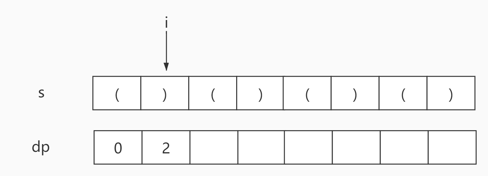
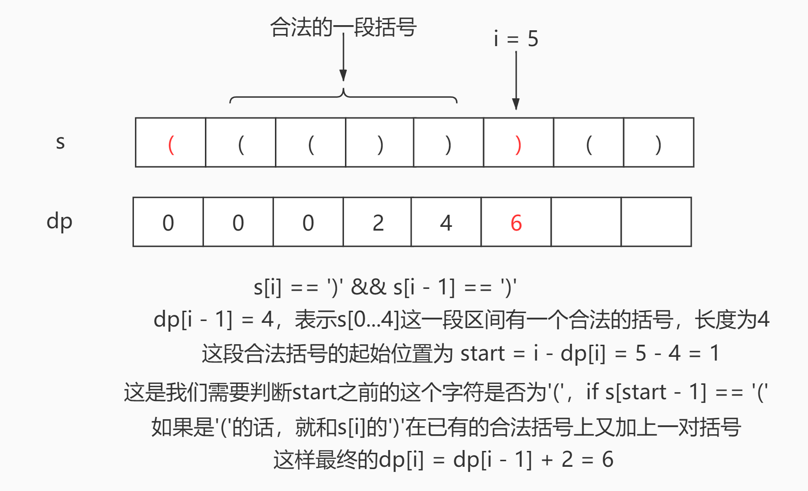
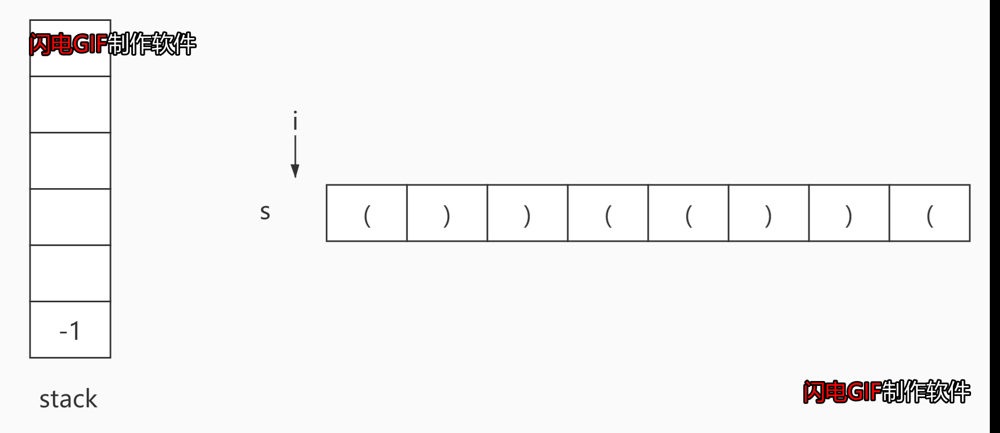

# <center>leetcode problem 32. 最长有效括号</center>

## 链接

https://leetcode-cn.com/problems/longest-valid-parentheses/


## 题目描述

给你一个只包含 \'(\' 和 \')\' 的字符串，找出最长有效（格式正确且连续）括号子串的长度。

 

示例 1：

输入：s = \"(()\"
输出：2
解释：最长有效括号子串是 \"()\"
示例 2：

输入：s = \")()())\"
输出：4
解释：最长有效括号子串是 \"()()\"
示例 3：

输入：s = \"\"
输出：0


提示：

0 <= s.length <= 3 * 104
s[i] 为 \'(\' 或 \')\'


## 解法

### 1.

使用动态规划的方法。使用一个dp数组，其中dp\[i\]代表s\[0...i\]的字符串中最长的有效括号的长度，但是这个dp有个限制，就是如果在当前的s\[0...i\]中，以索引0...i-1中任意一个字符为起始，以索引i为结尾的字符，必须是有效的括号，才计算其的长度dp\[i\]，否则计为0，比如s\[i\]为\'(\'，那么s\[0...i\]中的任意的以索引i为结尾的字符串都不可能是有效括号，dp\[i\]为0，这是为了当遇到有效的括号可以延续长度的时候可以方便使用dp的既有结果来辅助计算。如果中间括号的有效性断掉的话，就得重新计算有效括号的字符串的长度。

有了这个dp数组的定义，接下来我们需要分析一下状态转移的方式，根据括号的特性，有两种情况。

1: 当s\[i\] == \')\' 并且 s\[i - 1\] == \'(\'时，s\[i-1...i\]之间的有效括号长度为2，是一对有效的括号，此时判断s\[0...i-2\]之间的有效括号长度，即dp\[i - 2\]，在此基础上 +2，即得到公式dp\[i\] = dp\[i - 2\] + 2



2: 当s\[i\] == \')\' 并且 s\[i - 1\] == \')\'时，向前寻找对应的\'(\'和最后一个s\[i\]的\')\'匹配，这种情况只能成立在前面的\'(\'与最后的\')\'之间的子串是有效括号才行，所以根据s\[i - 1\]对应的dp\[i - 1\]得到的有效括号长度后，向前寻找这串子串之前的一个字符是否为\'(\'，即s\[i - dp\[i - 1\] - 1\] == \'(\'，如果成立，即s\[i - dp\[i - 1\] - 1\]到s\[i\]之间都是有效的括号，此时dp\[i\] = dp\[i - 1\] + 2，但是如果在s\[i - dp\[i - 1\] - 1\]之前，还有有效的括号字串的话，就需要再加上这部分的长度，即最终的dp\[i\] = dp\[i - dp\[i - 1\] - 2\] + dp\[i - 1\] + 2



#### 代码

```c++
class Solution {
public:
    int LongestValidParentheses(const std::string& s) 
    {
        if (s == "")
        {
            return 0;
        }

        int max_len = 0;
        std::vector<int> dp = std::vector<int>(s.size(), 0);

        for (int i = 1; i < s.size(); ++i)
        {
            if (s[i] == '(')
            {
                dp[i] = 0;
            }
            else if (s[i] == ')' && s[i - 1] == '(')
            {
                dp[i] = i - 2 >= 0 ? dp[i - 2] + 2 : 2;
            }
            else if (s[i] == ')' && s[i - 1] == ')' && (i - dp[i - 1] - 1) >= 0 && s[i - dp[i - 1] - 1] == '(')
            {
                dp[i] = i - dp[i - 1] - 2 >= 0 ? dp[i - dp[i - 1] - 2] + dp[i - 1] + 2 : dp[i - 1] + 2;
            }

            if (dp[i] > max_len)
            {
                max_len = dp[i];
            }
        }

        return max_len;
    }
};
```

### 2.

使用栈的方法。保持栈底一直有一个标识起始位置之前的索引值，\'(\'入栈，\')\'出栈，每个右括号出栈的时候，查看栈中是否包含之前的索引位置，用以计算当前的有效括号的长度，并更新到最大长度中，如果栈中为空的话，将右括号当前的索引入栈，作为下一个可能的有效括号的起始位置之前的索引。



#### 代码

```c++
class Solution {
public:
    int LongestValidParentheses(const std::string& s)
    {
        int max_len = 0;
        std::stack<int> st;
        st.push(-1);

        for (int i = 0; i < s.size(); ++i)
        {
            if (s[i] == '(')
            {
                st.push(i);
            }
            else if (s[i] == ')')
            {
                if (st.empty())
                {
                    st.push(i);
                }
                else
                {
                    st.pop();
                    if (st.empty())
                    {
                        st.push(i);
                    }
                    else
                    {
                        int offset = i - st.top();
                        max_len = offset > max_len ? offset : max_len;
                    }
                }
            }
        }

        return max_len;
    }
};
```

### 3.

左右遍历的方法。根据\'(\'和\')\'出现配对的情况进行判断，由于这次的括号只包含小括号，我们可以使用左右括号的计数来判断是否是合理的括号，注意，从左遍历的话右括号数大于左括号数的时候，就代表当前的括号无效了，必须从头重新判断括号，反之亦然。

#### 代码

```c++
class Solution {
public:
    int LongestValidParentheses(const std::string& s)
    {
        int max_len = 0;
        int left_count = 0;
        int right_count = 0;

        for (int i = 0; i < s.size(); ++i)
        {
            if (s[i] == '(')
            {
                ++left_count;
            }
            else if (s[i] == ')')
            {
                ++right_count;
            }

            if (left_count == right_count)
            {
                max_len = left_count + right_count > max_len ? left_count + right_count : max_len;
            }
            else if (right_count > left_count)
            {
                left_count = 0;
                right_count = 0;
            }
        }

        left_count = 0;
        right_count = 0;

        for (int i = s.size() - 1; i >= 0; --i)
        {
            if (s[i] == '(')
            {
                ++left_count;
            }
            else if (s[i] == ')')
            {
                ++right_count;
            }

            if (left_count == right_count)
            {
                max_len = left_count + right_count > max_len ? left_count + right_count : max_len;
            }
            else if (left_count > right_count)
            {
                left_count = 0;
                right_count = 0;
            }
        }

        return max_len;
    }
};
```
