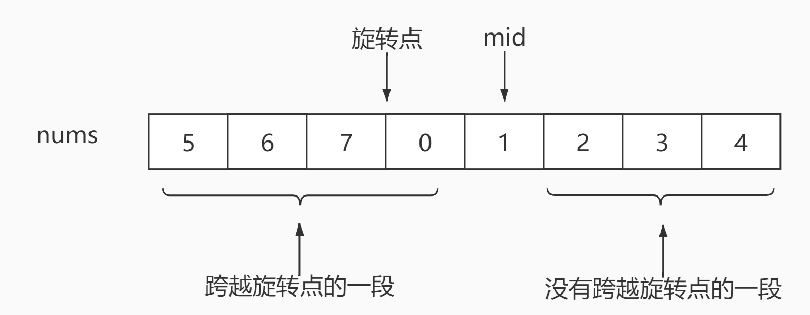

# <center>leetcode problem 33. 搜索旋转排序数组</center>

## 链接

https://leetcode-cn.com/problems/search-in-rotated-sorted-array/


## 题目描述

整数数组 nums 按升序排列，数组中的值 互不相同 。

在传递给函数之前，nums 在预先未知的某个下标 k（0 <= k < nums.length）上进行了 旋转，使数组变为 \[nums\[k\], nums\[k+1\], ..., nums\[n-1\], nums\[0\], nums\[1\], ..., nums\[k-1\]\]（下标 从 0 开始 计数）。例如， \[0,1,2,4,5,6,7\] 在下标 3 处经旋转后可能变为 \[4,5,6,7,0,1,2\] 。

给你 旋转后 的数组 nums 和一个整数 target ，如果 nums 中存在这个目标值 target ，则返回它的下标，否则返回 -1 。

 

示例 1：

输入：nums = \[4,5,6,7,0,1,2\], target = 0
输出：4
示例 2：

输入：nums = \[4,5,6,7,0,1,2\], target = 3
输出：-1
示例 3：

输入：nums = \[1\], target = 0
输出：-1


提示：

1 <= nums.length <= 5000
-10^4 <= nums\[i\] <= 10^4
nums 中的每个值都 独一无二
题目数据保证 nums 在预先未知的某个下标上进行了旋转
-10^4 <= target <= 10^4


进阶：你可以设计一个时间复杂度为 O(log n) 的解决方案吗？


## 解法

### 1.

由于数组旋转了，不是完全排序的数组，不能直接使用常规二分法，每次二分的时候，需要判断左右两段哪一段是完全在一边的(就是没有跨越中间的旋转点)。优先判断没有跨界的一段，判断target是否在其区间内，如果在，下一次就以这一段作为二分查找的区间，就是常规的二分查找了。如果target不在没有跨界的一段中，就选剩下的一段，继续做二分查找，直到找出结果。



#### 代码

```c++
class Solution 
{
public:
    int Search(const std::vector<int>& nums, const int target)
    {
        if (nums.size() == 0)
        {
            return -1;
        }

        if (target < nums[0] && target > nums[nums.size() - 1])
        {
            return -1;
        }

        int left = 0;
        int right = nums.size() - 1;
        int mid = 0;

        while (left <= right)
        {
            mid = (left + right) / 2;
            if (nums[mid] == target)
            {
                return mid;
            }

            if (nums[left] <= nums[mid])
            {
                if (nums[left] <= target && target <= nums[mid])
                {
                    right = mid - 1;
                }
                else
                {
                    left = mid + 1;
                }
            }
            else
            {
                if (nums[mid] <= target && target <= nums[right])
                {
                    left = mid + 1;
                }
                else
                {
                    right = mid - 1;
                }
            }
        }

        return -1;
    }
};
```

