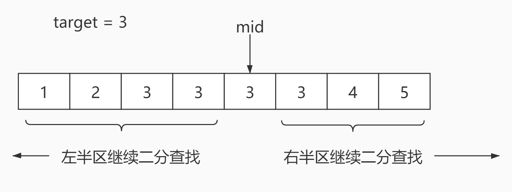

#  <center>leetcode problem 34. 在排序数组中查找元素的第一个和最后一个位置</center>

## 链接

https://leetcode-cn.com/problems/find-first-and-last-position-of-element-in-sorted-array/


## 题目描述

给定一个按照升序排列的整数数组 nums，和一个目标值 target。找出给定目标值在数组中的开始位置和结束位置。

如果数组中不存在目标值 target，返回 \[-1, -1\]。

进阶：

你可以设计并实现时间复杂度为 O(log n) 的算法解决此问题吗？


示例 1：

输入：nums = \[5,7,7,8,8,10\], target = 8
输出：\[3,4\]
示例 2：

输入：nums = \[5,7,7,8,8,10\], target = 6
输出：\[-1,-1\]
示例 3：

输入：nums = \[\], target = 0
输出：\[-1,-1\]


提示：

0 <= nums.length <= 105
-109 <= nums\[i\] <= 109
nums 是一个非递减数组
-109 <= target <= 109


## 解法

### 1.

使用二分查找，在找到目标值的情况下，以该索引为基础，向左右延申，继续在左右两段上做二分查找，寻找目标值。在左边的那段中，找到目标值之后，继续以该索引为右边界，继续向左查找目标值，右边的那段中，持续向右进行查找，直到无法再找到目标值为止，结束查找，最后得到目标值的左右边界，返回结果。



#### 代码

```c++
class Solution 
{
public:
    std::vector<int> SearchRange(const std::vector<int>& nums, const int target)
    {
        int first = FindTarget(nums, target, 0, nums.size() - 1);

        if (first == -1)
        {
            return std::vector<int>(2, -1);
        }

        int left_end = first;
        int right_end = first;
        int left = 0;
        int right = 0;
        int mid = 0;

        left = 0;
        right = first - 1;

        while (1)
        {
            mid = FindTarget(nums, target, left, right);
            if (mid != -1)
            {
                right = mid - 1;
                left_end = mid;
            }
            else
            {
                break;
            }
        }

        left = first + 1;
        right = nums.size() - 1;

        while (1)
        {
            mid = FindTarget(nums, target, left, right);
            if (mid != -1)
            {
                left = mid + 1;
                right_end = mid;
            }
            else
            {
                break;
            }
        }

        return std::vector<int>{left_end, right_end};
    }


    int FindTarget(const std::vector<int>& nums, const int target, int left, int right)
    {
        int mid = 0;

        while (left <= right)
        {
            mid = (left + right) / 2;

            if (nums[mid] > target)
            {
                right = mid - 1;
            }
            else if (nums[mid] < target)
            {
                left = mid + 1;
            }
            else
            {
                return mid;
            }
        }

        return -1;
    }
};
```

