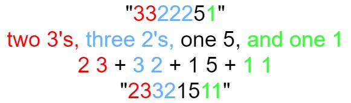

# <center>leetcode problem 38. 外观数列</center>

## 链接

https://leetcode-cn.com/problems/count-and-say/


## 题目描述

给定一个正整数 n ，输出外观数列的第 n 项。

「外观数列」是一个整数序列，从数字 1 开始，序列中的每一项都是对前一项的描述。

你可以将其视作是由递归公式定义的数字字符串序列：

countAndSay(1) = \"1\"
countAndSay(n) 是对 countAndSay(n-1) 的描述，然后转换成另一个数字字符串。
前五项如下：

1.     1
2.     11
3.     21
4.     1211
5.     111221
第一项是数字 1 
描述前一项，这个数是 1 即 “ 一 个 1 ”，记作 \"11\"
描述前一项，这个数是 11 即 “ 二 个 1 ” ，记作 \"21\"
描述前一项，这个数是 21 即 “ 一 个 2 + 一 个 1 ” ，记作 \"1211\"
描述前一项，这个数是 1211 即 “ 一 个 1 + 一 个 2 + 二 个 1 ” ，记作 \"111221\"
要 描述 一个数字字符串，首先要将字符串分割为 最小 数量的组，每个组都由连续的最多 相同字符 组成。然后对于每个组，先描述字符的数量，然后描述字符，形成一个描述组。要将描述转换为数字字符串，先将每组中的字符数量用数字替换，再将所有描述组连接起来。

例如，数字字符串 \"3322251\" 的描述如下图：




示例 1：

输入：n = 1
输出：\"1\"
解释：这是一个基本样例。
示例 2：

输入：n = 4
输出：\"1211\"
解释：
countAndSay(1) = \"1\"
countAndSay(2) = 读 \"1\" = 一 个 1 = \"11\"
countAndSay(3) = 读 \"11\" = 二 个 1 = \"21\"
countAndSay(4) = 读 \"21\" = 一 个 2 + 一 个 1 = \"12\" + \"11\" = \"1211\"


提示：

1 <= n <= 30


## 解法

### 1.

找到规律，以\"11\"为例，在生成下一个字符串的时候，根据已有字符串中的数字，如果有重复的比如\"11\"，在下一个字符串中就变成\"21\"，如果只有一个\"1\"，就变成\"11\"。即在有相连的相同字符的情况下，前面一个数字代表了已有字符的个数，如果只有一个的话，那前面只加1，例如\"2211\"变成\"2221\"，\"2221\"变成\"3211\"。

#### 代码

```c++
class Solution 
{
public:
    std::string CountAndSay(const int n) 
    {
        if (n == 0)
        {
            return "";
        }

        std::string s = "1";

        for (int i = n - 1; i > 0; --i)
        {
            std::string t;
            for (int j = 0; j < s.size(); ++j)
            {
                int count = 1;
                for (int k = j + 1; k < s.size() && s[j] == s[k]; ++k, ++j, ++count)
                {
                    ;
                }

                char buf[100];
                sprintf(buf, "%d", count);

                t += buf + std::string(1, s[j]);
            }

            s = t;
        }

        return s;
    }
};
```

