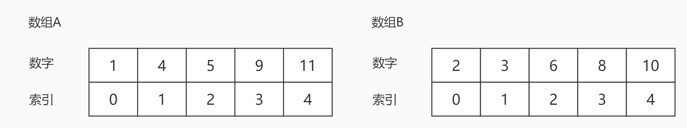
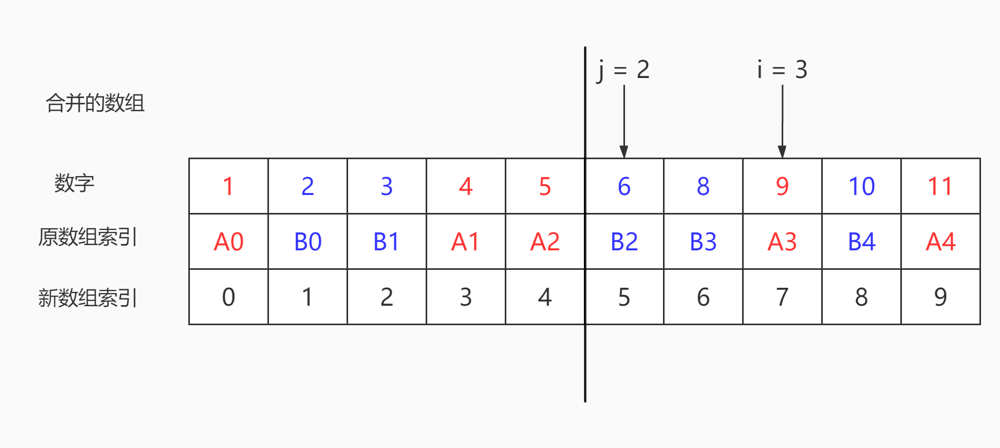

# <center>leetcode problem 4. 寻找两个正序数组的中位数</center>

## 链接

https://leetcode-cn.com/problems/median-of-two-sorted-arrays/


## 题目描述

给定两个大小分别为 m 和 n 的正序（从小到大）数组 nums1 和 nums2。请你找出并返回这两个正序数组的 中位数 。

 

示例 1：

输入：nums1 = [1,3], nums2 = [2]
输出：2.00000
解释：合并数组 = [1,2,3] ，中位数 2
示例 2：

输入：nums1 = [1,2], nums2 = [3,4]
输出：2.50000
解释：合并数组 = [1,2,3,4] ，中位数 (2 + 3) / 2 = 2.5
示例 3：

输入：nums1 = [0,0], nums2 = [0,0]
输出：0.00000
示例 4：

输入：nums1 = [], nums2 = [1]
输出：1.00000
示例 5：

输入：nums1 = [2], nums2 = []
输出：2.00000


提示：

nums1.length == m
nums2.length == n
0 <= m <= 1000
0 <= n <= 1000
1 <= m + n <= 2000
-106 <= nums1[i], nums2[i] <= 106

进阶：你能设计一个时间复杂度为 O(log (m+n)) 的算法解决此问题吗？


## 解法

### 1.

根据2个数组的长度算出中间值的索引，以升序分别从2个数组中取值，递增索引，直到找到中间值。

#### 代码

```c++
class Solution
{
public:
    double FindMedianSortedArrays(const std::vector<int>& nums1, const std::vector<int>& nums2) 
    {
        int even_flag = (nums1.size() + nums2.size()) % 2 == 0 ? 1 : 0;
        int previous_num = 0;
        int current_num = 0;
        int middle_index = (nums1.size() + nums2.size()) / 2;
        int index = -1;

        for (size_t i = 0, j = 0; ; )
        {
            if (i < nums1.size() && j < nums2.size())
            {
                if (nums1[i] < nums2[j])
                {
                    current_num = nums1[i++];
                }
                else
                {
                    current_num = nums2[j++];
                }
            }
            else if (i < nums1.size())
            {
                current_num = nums1[i++];
            }
            else if (j < nums2.size())
            {
                current_num = nums2[j++];
            }
            else
            {
                break;
            }

            if (++index == middle_index)
            {
                return even_flag == 1 ? (previous_num + current_num) / 2.0f : current_num;
            }

            previous_num = current_num;
        }

        return 0;
    }
};
```

### 2.

假设有2个已经排序好的数组A，B长度分别为m，n，如果将这两个数组合并在一起，升序排列后得到新的数组，一定可以平均分成两部分(如果总长度为奇数那么中间就会多一个数)，这时候可以很轻松的判断出中位数是什么，如果长度为偶数，中位数=(左边最大数 + 右边最小数) / 2，如果长度为奇数那中位数就是最中间的那个数。

这时候就一定会有两个分割点索引i，j，将数组A和B分别从i，j的位置分成左右两个部分。A左 + B左构成新数组的左半部分，A右 + B右构成新数组的右半部分，如果A和B的总长度为偶数的话，这两部分长度相同，如果为奇数的话，就让左边的长度比右边多1(这样方便后面的计算)。在进行了这样的拆分之后，可以保证A左和B左中的任意一个数必定 <= A右和B右中的任意一个数，即A[i - 1] <= B[j] && B[j - 1] <= A[i]，因为数组都是升序排列的，所以这个判断条件肯定是A左中的最大值 <= B右中的最小值，B左中的最大值 <= A右中的最小值，举例：



先合并排成新数组



很明显的可以看到，中位数在5和6之间，即为5.5，A左为1，4，5，A右为9，11，i为3，B左为2，3，B右为6，8，10，j为2。并且满足上述条件A[i - 1] <= B[j] && B[j - 1] <= A[i]，在这里就是A[2] = 5 <= B[2] = 6，B[1] = 3 <= A[3] = 9，奇数的情况也是类似，不过左半部分会多出一个值。

由此结论可以推导出一个公式 i + j = m - i + n - j，如果m + n为奇数，这里等式右边需要+1，因为i + j可以理解为合并后的数组左半边的个数，m - i + n - j可以理解为合并后的数组右半边的个数，奇数的情况我们让左半边多了一个数，所以这里需要+1。由此可以得出求j的公式，j = (m + n + 1) / 2 - i，其中的+1是为了可以同时处理偶数和奇数的情况。这个公式有一个要求，m <= n，即数组A为长度较小的那一个，因为 0 <= i < m，如果 m > n，可能会导致j为负数。之后就可以对数组A(长度较小的)进行二分查找了，找到合适的i，并通过公式得到相应的j，根据结果推断下一次二分查找的方向或者是得到最终的结果，二分查找只会遇到三种情况:

1: (i == 0 || j == n || A[i - 1] <= B[j]) && (j == 0 || i == m || B[j - 1] <= A[i])，A左的最大值小于等于B右的最小值，B左的最大值小于等于A右的最小值，表示找到了正确结果，考虑到边界情况可能遇到i - 1，i，j - 1，j的索引值无效，需要加上额外判断条件。

2: i > 0 && j < n && A[i - 1] > B[j]，当前i的值过大，i需要向左移动，找到更小的值(数组是升序排列的)，根据求j公式相应的j会更大，找到更大的值，将下一次二分查找的区间定位到左半区，同样需要考虑边界。

3: j > 0 && i < m && B[j - 1] > A[i]，当前i的值过小，i需要向右移动，找到更大的值，根据求j公式相应的j会更小，找到更小的值，将下一次二分查找的区间定位到右半区，同样需要考虑边界。

不断进行二分查找，直到找到结果或者循环结束，得到相应的i，j，如果m + n为奇数，则中位数为max(A[i - 1]，B[j - 1])，此时也需要注意边界，如果i == 0或j == 0则要取另外一个值。如果m + n为偶数，则取max(A[i - 1], B[j - 1]) + min(A[i]，B[j]) / 2，同样如果有边界问题的话，取另一个值。

#### 代码

```c++
class Solution
{
public:
    double FindMedianSortedArrays(const std::vector<int>& nums1, const std::vector<int>& nums2)
    {
        if (nums1.size() > nums2.size())
        {
            return FindMedianSortedArraysBinarySerach(nums2, nums1);
        }

        int len1 = nums1.size();
        int len2 = nums2.size();

        int low = 0;
        int high = len1;
        int i = 0;
        int j = 0;

        while (low <= high)
        {
            i = (low + high) / 2;
            j = (len1 + len2 + 1) / 2 - i;

            if ((i == 0 || j == len2 || nums1[i - 1] <= nums2[j]) &&
                (i == len1 || j == 0 || nums2[j - 1] <= nums1[i]))
            {
                break;
            }
            else if (i > 0 && j < len2 && nums1[i - 1] > nums2[j])
            {
                high = i - 1;
            }
            else if (j > 0 && i < len1 && nums2[j - 1] > nums1[i])
            {
                low = i + 1;
            }
        }

        int left_max = 0;
        if (i == 0)
        {
            left_max = nums2[j - 1];
        }
        else if (j == 0)
        {
            left_max = nums1[i - 1];
        }
        else
        {
            left_max = std::max(nums1[i - 1], nums2[j - 1]);
        }

        if ((len1 + len2) % 2 == 1)
        {
            return left_max;
        }

        int right_min = 0;
        if (i == len1)
        {
            right_min = nums2[j];
        }
        else if (j == len2)
        {
            right_min = nums1[i];
        }
        else
        {
            right_min = std::min(nums1[i], nums2[j]);
        }

        return (left_max + right_min) / 2.0f;
    }
};
```


