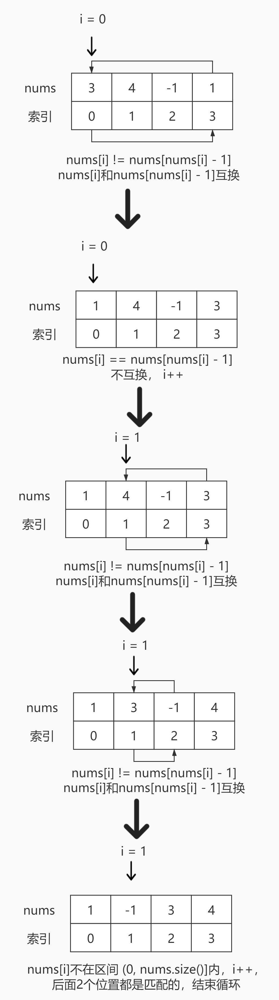

# <center>leetcode problem 41. 缺失的第一个正数</center>

## 链接

https://leetcode-cn.com/problems/first-missing-positive/


## 题目描述

给你一个未排序的整数数组 nums ，请你找出其中没有出现的最小的正整数。

请你实现时间复杂度为 O(n) 并且只使用常数级别额外空间的解决方案。


示例 1：

输入：nums = \[1,2,0\]
输出：3
示例 2：

输入：nums = \[3,4,-1,1\]
输出：2
示例 3：

输入：nums = \[7,8,9,11,12\]
输出：1


提示：

1 <= nums.length <= 5 * 105
-231 <= nums\[i\] <= 231 - 1


## 解法

### 1.

有一个数组，假设长度为4，根据题意，在正常情况下，每个正数都出现的话，那么其中的元素应该是1，2，3，4，但是假如实际情况是1，5，3，4找出最小消失的正整数，即为2。这个数组在假设正常的情况下有一个特点，即nums\[i\] = i + 1，根据这样的公式，使用数组本身作为存储介质，在遍历过程中根据公式将乱序的数组元素放到原来应该出现的位置上，如果3，4，-1，1，根据元素的值找到其对应的索引位置，如nums\[0\] = 3，值为3，其位置应该是nums\[2\]，对比nums\[0\]和nums\[2\]发现值并不相等，对调位置，将3放回到nums\[2\]的位置上，但是这个换位是有条件的，即nums\[i\]的值必须处于(0，nums.size()\]的区间内，且如果2个位置上的值相同的话，就直接跳过，继续下次遍历。依此完成遍历，得到结果1，-1，3，4，发现缺少的最小正数为2。



#### 代码

```c++
class Solution 
{
public:
    int FirstMissingPositive(std::vector<int>& nums) 
    {
        for (int i = 0; i < nums.size(); ++i)
        {
            while (nums[i] > 0 && nums[i] <= nums.size() && nums[nums[i] - 1] != nums[i])
            {
                std::swap(nums[i], nums[nums[i] - 1]);
            }
        }

        for (int i = 0; i < nums.size(); ++i)
        {
            if (nums[i] - 1 != i)
            {
                return i + 1;
            }
        }

        return nums.size() + 1;
    }
};
```

