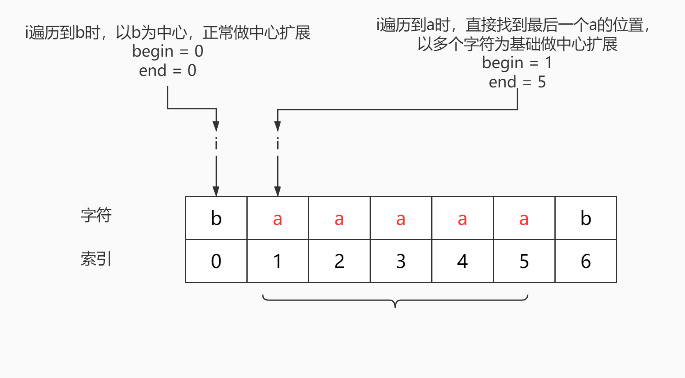
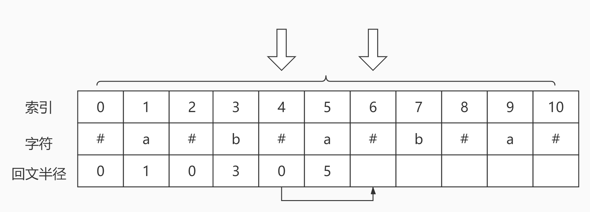
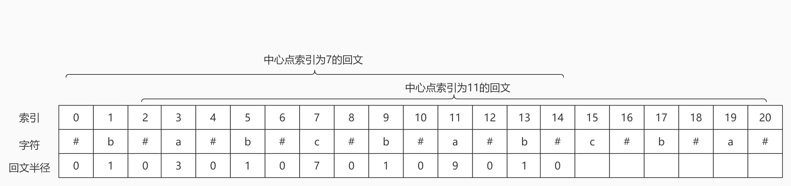
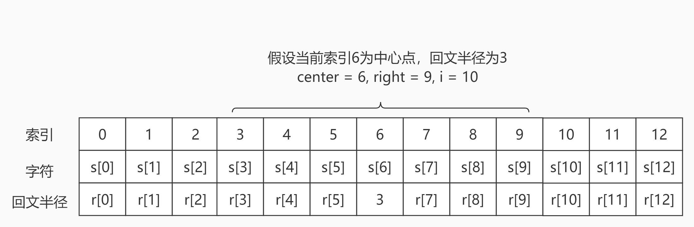
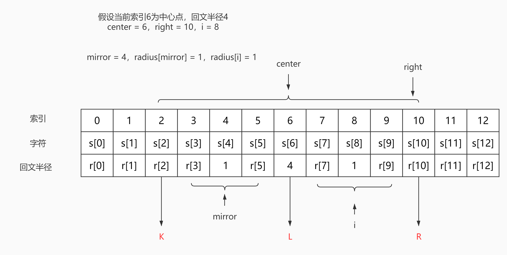
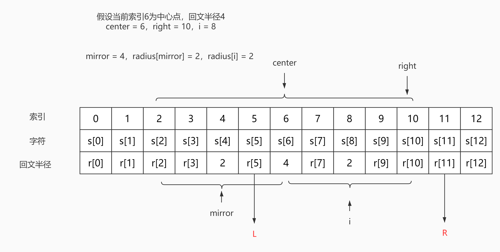
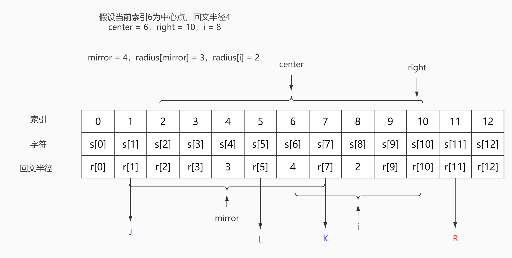

# <center>leetcode problem 5. 最长回文子串</center>

## 链接

https://leetcode-cn.com/problems/longest-palindromic-substring/


## 题目描述

给你一个字符串 s，找到 s 中最长的回文子串。

 

示例 1：

输入：s = \"babad\"
输出：\"bab\"
解释：\"aba\" 同样是符合题意的答案。
示例 2：

输入：s = \"cbbd\"
输出：\"bb\"
示例 3：

输入：s = \"a\"
输出：\"a\"
示例 4：

输入：s = \"ac\"
输出：\"a\"


提示：

1 <= s.length <= 1000
s 仅由数字和英文字母（大写和/或小写）组成


## 解法

### 1.

暴力求解，遍历所有子串，判断是否为回文，再判断长度。

#### 代码

```c++
class Solution
{
public:
    std::string LongestPalindrome(const std::string& s) 
    {
        if (s == "")
        {
            return "";
        }

        size_t size = s.size();
        size_t left_index = 0;
        int length = 0;
        int max_length = 1;

        for (size_t i = 0; i < size - 1; ++i)
        {
            for (size_t j = size - 1; j >= i + 1; --j)
            {
                length = j - i + 1;
                if (length <= max_length)
                {
                    break;
                }

                if (this->IsPalindrome(s, i, j))
                {
                    max_length = length;
                    left_index = i;
                }
            }
        }

        return s.substr(left_index, max_length);
    }

private:
    bool IsPalindrome(const std::string& s, const size_t begin, const size_t end)
    {
        size_t mid = (begin + end) / 2;
        size_t base = begin + end;

        for (size_t i = begin; i <= mid; ++i)
        {
            if (s[i] != s[base - i])
            {
                return false;
            }
        }

        return true;
    }
};
```

### 2.

使用动态规划的方式。举例假设有字符串s=\"ababa\"，中间的\"bab\"是一个回文，\"bab\"的左右两边都是相等的\'a\'，那整个字符串\"ababa\"也是回文。我们使用一个二维数组dp来表示2个索引所构成的子串是否是回文，dp[i] [j]表示s中下标从i到j所构成的子串是否为回文。根据上面的\"ababa\"的例子，dp[0] [4]即\"ababa\"是否为回文的条件为dp[0] [4] = dp[1] [3] && s[0] == s[4]，根据这样的性质，我们可以通过从短的子串开始，构建dp数组的结果，从而得到那些较长的子串结果，一共有三种情况：

1: dp[i] [i] = true，单字符子串。

2: dp[i] [i + 1] = s[i] == s[i + 1]，相邻的2个字符的子串，必须2个字符相等。

3: dp[i] [j] = dp[i + 1] [j - 1] && s[i] == s[j]，2个字符以上的子串，必须依赖中间子串的结果和首尾2个字符是否相等。

从短的子串开始生成动态规划的结果，应用在长子串上，最终得出结果。

#### 代码

```c++
class Solution
{
public:
    std::string LongestPalindrome(const std::string& s) 
    {
        if (s == "")
        {
            return "";
        }

        size_t size = s.size();
        size_t left_index = 0;
        int length = 0;
        int max_length = 1;

        std::vector<bool> temp(size, false);
        std::vector<std::vector<bool> > dp_result(size, temp);

        for (size_t len = 0; len < size; ++len)
        {
            for (size_t i = 0; i + len < size; ++i)
            {
                size_t j = i + len;

                if (len == 0)
                {
                    dp_result[i][j] = true;
                }
                else if (len == 1)
                {
                    dp_result[i][j] = s[i] == s[j];
                } 
                else
                {
                    dp_result[i][j] = dp_result[i + 1][j - 1] && s[i] == s[j];
                }

                if (dp_result[i][j])
                {
                    length = j - i + 1;
                    if (length > max_length)
                    {
                        max_length = length;
                        left_index = i;
                    }
                }
            }
        }

        return s.substr(left_index, max_length);
    }
};
```

### 3.

中心扩展的方式，以每个字符为中心，向两边扩张，找到最长的回文子串。但是需要区分回文的奇偶，所以一个字符需要做两次扩张，一次是以自己本身为中心，一次以自己本身和下一个字符的中间为中心。

#### 代码

```c++
class Solution
{
public:
    std::string LongestPalindrome(const std::string& s)
    {
        if (s == "")
        {
            return "";
        }

        size_t size = s.size();
        size_t left_index = 0;
        int max_length = 1;

        for (size_t i = 0; i < size; ++i)
        {
            size_t temp_left_1 = 0;
            size_t temp_left_2 = 0;
            int length_1 = this->PalindromeLength(s, i, i, temp_left_1);
            int length_2 = i < size - 1 ? this->PalindromeLength(s, i, i + 1, temp_left_2) : 0;

            if (length_1 > length_2 && length_1 > max_length)
            {
                max_length = length_1;
                left_index = temp_left_1;
            }
            else if (length_2 >= length_1 && length_2 > max_length)
            {
                max_length = length_2;
                left_index = temp_left_2;
            }
        }

        return s.substr(left_index, max_length);
    }

private:
    int PalindromeLength(const std::string& s, size_t begin, size_t end, size_t& left)
    {
        int length = 0;

        while (s[begin] == s[end])
        {
            length = end - begin + 1;
            left = begin;
            if (begin > 0 && end < s.size())
            {
                --begin;
                ++end;
            }
            else
            {
                break;
            }
        }

        return length;
    }
};
```

### 4.

中心扩展的另一种更高效的方式，如果是类似\"baaaaab\"这样包含很多重复字符的字符串，一个一个字符处理扩展中心，很低效，直接找到这样的一连串相同字符的头和尾，以一个多字符的子串作为中心扩展的开始，再向两侧扩展。



当遍历到\'b\'时，之后没有重复的字符，直接以\'b\'开始做中心扩展，但是在遍历到第一个\'a\'时，发现后面有很多的\'a\'，直接找到最后一个\'a\'出现的位置，以这一长串为基础开始中心扩展，这样省去了中间很多步单独以\'a\'做中心扩展的重复操作。并且这种方法天然的处理了奇数和偶数的情况，因为如果回文的中心在两个字符之间的话，这两个字符必然是相同的。

#### 代码

```c++
class Solution
{
public:
    std::string LongestPalindrome(const std::string& s) 
    {
        if (s == "")
        {
            return s;
        }

        size_t size = s.size();
        size_t left_index = 0;
        int max_length = 1;

        for (size_t i = 0; i < size; )
        {
            // 这里的判断，size - i - 1 是计算出了如果以当前的i为中心点的话
            // i与字符串最后一个字符之间的长度，即如果以i为中心可以扩展成回文的话
            // 这个回文的最大半径，如果不大于已存在的回文最大长度的一半，那就可以直接退出循环，得出结果，不用再计算后面的了
            if (size - i - 1 <= max_length / 2)
            {
                break;
            }

            size_t begin = i;
            size_t end = i;

            while (end < size - 1 && s[begin] == s[end + 1])
            {
                ++end;
            }

            i = end + 1;

            while (begin > 0 && end < size && s[begin - 1] == s[end + 1])
            {
                --begin;
                ++end;
            }

            if (end - begin + 1 > max_length)
            {
                max_length = end - begin + 1;
                left_index = begin;
            }
        }

        return s.substr(left_index, max_length);
    }
};
```

### 5.

manacher算法。首先给字符串中每个字符的间隔添加一个额外字符，假定为\'#\'，这样可以使回文子串无论是奇数长度还是偶数长度，都变成奇数长度，方便统一处理。之后首尾分别加上不同的2个任意字符，假定为\'$\'和\'^\'，为了不用特意处理边界问题，简单处理之后就构成了一个新字符串str。

这个算法的核心思想是保持一个与新字符串str长度相同的数组radius，数组中radius[i]的值表示以新字符串str[i]所对应的字符为中心构成的回文的最大半径。如\"abc\"中\'b\'对应的值就是0，\"aba\"中\'b\'对应的就是1，通过遍历一次字符串，求出每个位置上的字符对应的radius数组中的值。然后只要找出最大的值对应的那个字符，就能找出最长的回文子串。这个算法还是需要用到中心扩展，但是并不是每个字符都需要中心扩展。根据回文的对称性规则，我们可以省略很多字符的中心扩展计算过程，可以很轻易的得到其对应的radius[i]的半径。

举例:



第一行是索引，第二行是新字符串中的字符(图中暂先不考虑首尾的占位字符)，第三行是对应的半径值的数组。肉眼可见，中间的\'a\'构成的回文是最长的，假设此时我们已经遍历完这个\'a\'，得到当前以索引5的\'a\'为中心点的回文半径为5，并且扩展的右边界为索引为10的\'#\'。此时需要求索引6的\'#\'对应的回文半径，由于这个索引6处于从中心\'a\'扩展到右边界\'#\'的中间，5 < 6 < 10，假设中心点索引为center，当前点索引为i，镜像索引为mirror，通过公式我们可以获得它的镜像索引，mirror = 2 * center - i = 2 * 5 - 6 = 4，索引4处的\'#\'是索引6在以索引5的\'a\'为中心的回文中的镜像，所以我们可以得到radius[6] = radius[4]，根据已有的值求出后面的值，也算是一种动态规划的方式，但是也有特例。

举例:

假设当前的字符串正在求radius[15]的值，现在可知当前的center是索引11处的\'a\'，半径为9，右边界的索引为20的\'#\'。此时的mirror索引为2 * 11 - 15 = 7，即索引为7的\'c\'，但是此处不可以直接镜像赋值，因为虽然str[7]为当前回文中的值，但是注意其radius[7]为7，表明以该str[7]为中心的回文半径为7，其构成的回文的左边一部分在当前大回文的外部，再观察需要求值的索引15与右边界索引20相差5，但是对应镜像的回文半径为7，如果以7为半径在索引15的位置进行扩展就会超过大回文的边界，对于这种情况我们不能直接将镜像索引的回文半径更新给当前需要求的索引，对于这种当前求的索引i在大回文内部的，我们可以归纳为三种情况，但是对于i大于右边界的情况，就需要单独中心扩展。

首先确定几个变量，当前回文中心点索引center，右边界right，当前求值的索引i，镜像索引为mirror，归纳为以下四种情况：

1：i > right，当前索引已经超出大回文的范围，必须以其为中心点，单独进行中心扩展。



2：i <= right，mirror = 2 * center - i，如果radius[mirror] < right - i，即镜像的回文处在大回文内部，radius[i] = radius[mirror]。



如图，索引8处的回文半径为对应镜像索引4的回文半径1，现在s[7]，s[8]，s[9]是回文。假设我们对这个结果有疑问，我们可以判断一下s[6]和s[10]是否相等，我们在图中假设s[2]，s[6]，s[10]分别为K，L，R，首先在以索引6为中心的大回文中，K = R。由于索引4处的回文半径是已知的1，所以K != L，那么一定有L != R，所以索引8处的回文半径的确只有1，L和R并不相等。从而证实了在i <= right && radius[mirror] < right - i的情况下，radius[i] = radius[mirror]。

3：i <= right，mirror = 2 * center - i，如果radius[mirror] = right - i，即镜像的回文正好落在大回文的边缘，radius[i] = right - i，并在此基础上进行中心扩展。



如图，索引8的回文半径右边界正好落在了大回文的右边界上，这个回文的左右两边的字符我们称为L和R，R在大回文的外面，无法判断L是否等于R，所以我们只能暂时认为radius[i]的最小值为radius[mirror]，然后在这个基础上，继续做中心扩展，才能得到最终结果。

4：i <= right，mirror = 2 * center - i，如果radius[mirror] > right - i，即镜像的回文超过大回文的左边界，radisu[i] = right - i。



如图，i = 8，mirror = 4，但是radius[4] = 3，right - i = 2，镜像的回文超出了大回文的左边界，所以radius[i] = right - i，即radisu[8] = 2。同样我们也可以对这个结论进行证明。现在s[6]，s[7]，s[8]，s[9]，s[10]为回文，那假设他的回文不止这么长，那我们下一步就要判断s[5]是否等于s[11]，那我们用L和R分别代表s[5]和s[11]。已知radius[4] = 3，那s[1] = s[7]，我们也用J和K代表s[1]和s[7]。L和K在大回文中是对称的，所以L = K，并且在镜像的回文中我们发现，J = K，所以L = J，但是J和R分别对称处在大回文的外部，所以J != R，所以L != R，所以radius[8]只能是2，证明了我们的结论。

#### 代码

```c++
class Solution
{
public:
    std::string LongestPalindrome(const std::string& s)
    {
        if (s == "")
        {
            return s;
        }

        size_t size = s.size();
        std::string new_str;
        for (size_t i = 0; i < size; ++i)
        {
            new_str = new_str + s[i] + "#";
        }
        new_str = "&#" + new_str + "^";

        size = new_str.size();
        std::vector<int> radius(size, 0);
        int center = 0;
        int right = 0;
        int mirror = 0;

        for (size_t i = 1; i < size - 1; ++i)
        {
            if (right >= i)
            {
                mirror = 2 * center - i;
                if (radius[mirror] < right - i)
                {
                    radius[i] = radius[mirror];
                }
                else if (radius[mirror] > right - i)
                {
                    radius[i] = right - i;
                }
                else
                {
                    radius[i] = right - i;
                    while (new_str[i - radius[i] - 1] == new_str[i + radius[i] + 1])
                    {
                        ++radius[i];
                    }

                    center = i;
                    right = i + radius[i];
                }
            }
            else
            {
                while (new_str[i - radius[i] - 1] == new_str[i + radius[i] + 1])
                {
                    ++radius[i];
                }

                center = i;
                right = i + radius[i];
            }
        }

        int max_length = 0;
        size_t mid_index = 0;
        for (size_t i = 0; i < size; ++i)
        {
            if (radius[i] > max_length)
            {
                max_length = radius[i];
                mid_index = i;
            }
        }

        return s.substr((mid_index - max_length - 1) / 2, max_length);
    }
};
```

