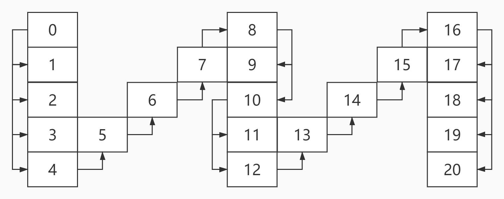

# <center>leetcode problem 6. Z 字形变换</center>

## 链接

https://leetcode-cn.com/problems/zigzag-conversion/


## 题目描述

将一个给定字符串 s 根据给定的行数 numRows ，以从上往下、从左到右进行 Z 字形排列。

比如输入字符串为 "PAYPALISHIRING" 行数为 3 时，排列如下：

P   A   H   N
A P L S I I G
Y   I   R
之后，你的输出需要从左往右逐行读取，产生出一个新的字符串，比如：\"PAHNAPLSIIGYIR\"。

请你实现这个将字符串进行指定行数变换的函数：

string convert(string s, int numRows);


示例 1：

输入：s = \"PAYPALISHIRING\", numRows = 3
输出：\"PAHNAPLSIIGYIR\"
示例 2：
输入：s = \"PAYPALISHIRING\", numRows = 4
输出：\"PINALSIGYAHRPI\"
解释：
P     I    N
A   L S  I G
Y A   H R
P     I
示例 3：

输入：s = \"A\", numRows = 1
输出：\"A\"


提示：

1 <= s.length <= 1000
s 由英文字母（小写和大写）、\',\' 和 \'.\' 组成
1 <= numRows <= 1000


## 解法

### 1.

这个问题其实就是把字符串排成Z字形状，行数就是Z字边的长度，以字符串中字符索引代替字符举例如下图，假设行数为5：



观察后得到规律，竖着的边是从上往下，然后再一条斜线到达第二条边的上方，即每次从字符串中先获取num_rows个字符，再取num_rows - 2个字符，以此往复，直到遍历完字符串。用手在上图中模拟下画Z字的过程，就会轻易的发现解法。我们可以使用一个数组，保存每行的字符串，使用一个变量current_row在num_rows和0之间来回摆动，并在达到顶部和底部的时候反弹回去，每移动一次，从字符串中取出一个字符，记录在该行对应的字符串中，当遍历完成，我们的字符串数组中保存的就是每一行的字符，最后再拼接起来就是最终的结果。

#### 代码

```c++
class Solution
{
public:
    std::string Convert(const std::string& s, const int num_rows) 
    {
        if (num_rows <= 1)
        {
            return s;
        }

        int current_row = 0;
        bool direction_down = false;
        std::vector<std::string> result_vec(num_rows);

        for (size_t i = 0; i < s.size(); ++i)
        {
            result_vec[current_row] += s[i];
            if (current_row == 0 || current_row == num_rows - 1)
            {
                direction_down = !direction_down;
            }

            current_row = current_row + (direction_down ? 1 : -1);
        }

        std::string result;
        for (size_t i = 0; i < result_vec.size(); ++i)
        {
            result += result_vec[i];
        }

        return result;
    }	
};
```

### 2.

继续观察上图，发现规律，每条竖线的每个索引相差值为2 * num_rows - 2，假设这个固定间隔为interval。我们现在一行一行的遍历，假设i为当前行数，j为从0不断自增1的变量，所以对于每条竖线上的值，我们可以通过i + j * interval求出其对应在字符串中的索引，自增的结束条件为索引是否超过了字符串的长度。对于那些处于中间斜线上的索引值(排除顶部和底部的行)，可以通过相邻的后面一个竖线上的第一行的值推算出来，(j + 1) * interval - i。如上图所示，要求第二行的第二个值，图中即为索引7的位置，先求其后面的竖线上的第一个值，（0 + 1）* 8 = 8，即索引8的位置，由于处在第二行，i = 1，那第二行的第二个值 = 8 - 1 = 7，因为斜线上的值都是按索引顺序排上来的。

#### 代码

```c++
class Solution
{
public:
    std::string Convert(const std::string& s, const int num_rows)
    {
        if (num_rows <= 1)
        {
            return s;
        }

        int interval = 2 * num_rows - 2;
        std::string result;

        for (int i = 0; i < num_rows; ++i)
        {
            for (int j = 0; (i + j * interval) < s.size(); ++j)
            {
                result = result + s[i + j * interval];
                if (i != 0 && i != num_rows - 1) 
                {
                    // (j + 1) * interval 代表后面的完整一列的第一行的字符
                    // 完整的两列之间的数字是斜着顺序排列的，上面提到的 4 - 5 - 6 - 7 - 8
                    // 所以斜着的字符的索引是由其后面的完整一列的第一行字符的索引减去其所在的行数来决定的
                    // i代表行数
                    int inner_index = (j + 1) * interval - i;
                    if (inner_index >= 0 && inner_index < s.size())
                    {
                        result = result + s[inner_index];
                    }
                }
            }
        }

        return result;
    }
};
```

