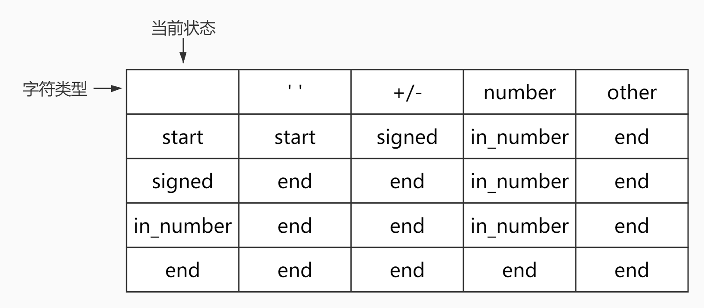

# <center>leetcode problem 8. 字符串转换整数 (atoi)</center>

## 链接

https://leetcode-cn.com/problems/string-to-integer-atoi/


## 题目描述

请你来实现一个 myAtoi(string s) 函数，使其能将字符串转换成一个 32 位有符号整数（类似 C/C++ 中的 atoi 函数）。

函数 myAtoi(string s) 的算法如下：

读入字符串并丢弃无用的前导空格
检查下一个字符（假设还未到字符末尾）为正还是负号，读取该字符（如果有）。 确定最终结果是负数还是正数。 如果两者都不存在，则假定结果为正。
读入下一个字符，直到到达下一个非数字字符或到达输入的结尾。字符串的其余部分将被忽略。
将前面步骤读入的这些数字转换为整数（即，\"123\" -> 123， \"0032\" -> 32）。如果没有读入数字，则整数为 0 。必要时更改符号（从步骤 2 开始）。
如果整数数超过 32 位有符号整数范围 [−231,  231 − 1] ，需要截断这个整数，使其保持在这个范围内。具体来说，小于 −231 的整数应该被固定为 −231 ，大于 231 − 1 的整数应该被固定为 231 − 1 。
返回整数作为最终结果。
注意：

本题中的空白字符只包括空格字符 \' \' 。
除前导空格或数字后的其余字符串外，请勿忽略 任何其他字符。


示例 1：

输入：s = \"42\"
输出：42
解释：加粗的字符串为已经读入的字符，插入符号是当前读取的字符。
第 1 步：\"42\"（当前没有读入字符，因为没有前导空格）
         ^
第 2 步：\"42\"（当前没有读入字符，因为这里不存在 \'-\' 或者 \'+\'）
         ^
第 3 步：\"42\"（读入 \"42\"）
           ^
解析得到整数 42 。
由于 \"42\" 在范围 [-231, 231 - 1] 内，最终结果为 42 。
示例 2：

输入：s = \"   -42\"
输出：-42
解释：
第 1 步：\"   -42\"（读入前导空格，但忽视掉）
            ^
第 2 步：\"   -42\"（读入 \'-\' 字符，所以结果应该是负数）
             ^
第 3 步：\"   -42\"（读入 \"42\"）
               ^
解析得到整数 -42 。
由于 \"-42\" 在范围 [-231, 231 - 1] 内，最终结果为 -42 。
示例 3：

输入：s = \"4193 with words\"
输出：4193
解释：
第 1 步：\"4193 with words\"（当前没有读入字符，因为没有前导空格）
         ^
第 2 步：\"4193 with words\"（当前没有读入字符，因为这里不存在 \'-\' 或者 \'+\'）
         ^
第 3 步：\"4193 with words\"（读入 "4193"；由于下一个字符不是一个数字，所以读入停止）
             ^
解析得到整数 4193 。
由于 \"4193\" 在范围 [-231, 231 - 1] 内，最终结果为 4193 。
示例 4：

输入：s = \"words and 987\"
输出：0
解释：
第 1 步：\"words and 987\"（当前没有读入字符，因为没有前导空格）
         ^
第 2 步：\"words and 987\"（当前没有读入字符，因为这里不存在 \'-\' 或者 \'+\'）
         ^
第 3 步：\"words and 987\"（由于当前字符 \'w\' 不是一个数字，所以读入停止）
         ^
解析得到整数 0 ，因为没有读入任何数字。
由于 0 在范围 [-231, 231 - 1] 内，最终结果为 0 。
示例 5：

输入：s = \"-91283472332\"
输出：-2147483648
解释：
第 1 步：\"-91283472332\"（当前没有读入字符，因为没有前导空格）
         ^
第 2 步：\"-91283472332\"（读入 \'-\' 字符，所以结果应该是负数）
          ^
第 3 步：\"-91283472332\"（读入 \"91283472332\"）
                     ^
解析得到整数 -91283472332 。
由于 -91283472332 小于范围 [-231, 231 - 1] 的下界，最终结果被截断为 -231 = -2147483648 。


提示：

0 <= s.length <= 200
s 由英文字母（大写和小写）、数字（0-9）、\' \'、\'+\'、\'-\' 和 \'.\' 组成


## 解法

### 1.

遍历字符串，先排除前导空格，然后如果遇到\'+\'或\'-\'或者先遇到了数字，直接进入数字判断，累加数字到结果变量中，直到遇到的字符不是数字为止。数值溢出的判断与problem7中的判断类似。

#### 代码

```c++
class Solution
{
public:
    int MyAtoi(const std::string& str) 
    {
        int character_flag = 0;
        bool positive = true;
        std::vector<int> digit_vec;

        for (size_t i = 0; i < str.size(); ++i)
        {
            if (character_flag == 0)
            {
                if (str[i] != ' ' && str[i] != '-' && str[i] != '+' && !isdigit(str[i]))
                {
                    return 0;
                }

                if (str[i] != ' ')
                {
                    character_flag = 1;
                }

                if (str[i] == '-')
                {
                    positive = false;
                }
                else if (isdigit(str[i]))
                {
                    digit_vec.emplace_back((str[i] - '0') * (positive ? 1 : -1));
                }
            }
            else
            {
                if (!isdigit(str[i]))
                {
                    break;
                }

                digit_vec.emplace_back((str[i] - '0') * (positive ? 1 : -1));
            }
        }

        int result = 0;
        for (size_t i = 0; i < digit_vec.size(); ++i)
        {
            if (result > INT_MAX / 10 || (result == INT_MAX / 10 && digit_vec[i] > 7))
            {
                return INT_MAX;
            }

            if (result < INT_MIN / 10 || (result == INT_MIN / 10 && digit_vec[i] < -8))
            {
                return INT_MIN;
            }

            result = result * 10 + digit_vec[i];
        }

        return result;
    }
};
```

### 2.

不使用数组保存数字，优化代码结构。

#### 代码

```c++
class Solution
{
public:
    int MyAtoi(const std::string& str)
    {
        bool positive = true;
        size_t i = 0;
        int result = 0;

        while (i < str.size() && str[i] == ' ')
        {
            ++i;
        }

        if (i < str.size() && (str[i] == '+' || str[i] == '-'))
        {
            positive = str[i] == '+';
            ++i;
        }

        while (i < str.size() && isdigit(str[i]))
        {
            int step = (str[i] - '0') * (positive ? 1 : -1);

            if (result > INT_MAX / 10 || (result == INT_MAX / 10 && step > 7))
            {
                return INT_MAX;
            }

            if (result < INT_MIN / 10 || (result == INT_MIN / 10 && step < -8))
            {
                return INT_MIN;
            }

            result = result * 10 + step;
            ++i;
        }

        return result;
    }	
};
```

### 3.

使用自动状态机，首先我们需要一个表。



其中start表示开始状态，signed表示选择符号状态，in_number表示计算数字状态，end表示结束。\' \'表示当前字符为空格，+/-表示遇到了符号字符，number表示当前字符为数字，other表示其他的字符。

第一列表示当前的状态是什么，第一行表示当前遇到的字符是什么情况，根据行和列得到的结果就是当前状态下，遇到了什么类型的字符，之后需要转移的状态。这个表我们使用一个嵌套的map表示，直接遍历字符串，把每个字符传入状态机，状态机会根据当前的状态和传入的这个字符的类型，自动选择下一个状态，决定需要进行的操作，遍历完字符串之后，就可以直接得到结果。数值溢出的判断与problem7中的判断类似，但是由于这种方法下的数值都是正数，所以在判断溢出的时候进行了特殊处理。

#### 代码

```c++
class Automaton
{
public:
    Automaton()
        : positive_(true),
    result_(0),
    state_("start")
    {
        this->table_["start"] = std::vector<std::string>{ "start", "signed", "in_number", "end" };
        this->table_["signed"] = std::vector<std::string>{ "end", "end", "in_number", "end" };
        this->table_["in_number"] = std::vector<std::string>{ "end", "end", "in_number", "end" };
        this->table_["end"] = std::vector<std::string>{ "end", "end", "end", "end" };
    }

    void Get(const char c)
    {
        this->state_ = this->table_[this->state_][this->GetCol(c)];
        if (this->state_ == "in_number")
        {
            int step = c - '0';

            if (this->result_ > INT_MAX / 10)
            {
                this->result_ = INT_MAX;
                if (!this->positive_)
                {
                    this->result_ = INT_MIN;
                    this->positive_ = true;
                }
                this->state_ = "end";
            }  
            else if (this->result_ == INT_MAX / 10 && step > 7)
            {
                this->result_ = INT_MAX;
                if (!this->positive_ && step >= 8)
                {
                    this->result_ = INT_MIN;
                    this->positive_ = true;
                    this->state_ = "end";
                }
            }
            else
            {
                this->result_ = this->result_ * 10 + step;
            }
        }
        else if (this->state_ == "signed")
        {
            this->positive_ = c == '+';
        }
    }

private:
    int GetCol(const char c)
    {
        if (isspace(c))
        {
            return 0;
        }

        if (c == '+' || c == '-')
        {
            return 1;
        }

        if (isdigit(c))
        {
            return 2;
        }

        return 3;
    }

public:
    bool positive_;

    int result_;

    std::string state_;

private:
    std::unordered_map<std::string, std::vector<std::string> > table_;
};

class Solution
{
public:	
    int MyAtoi(const std::string& str)
    {
        Automaton a;

        for (size_t i = 0; i < str.size(); ++i)
        {
            a.Get(str[i]);
            if (a.state_ == "end")
            {
                break;
            }
        }

        return a.result_ * (a.positive_ ? 1 : -1);
    }
};
```

