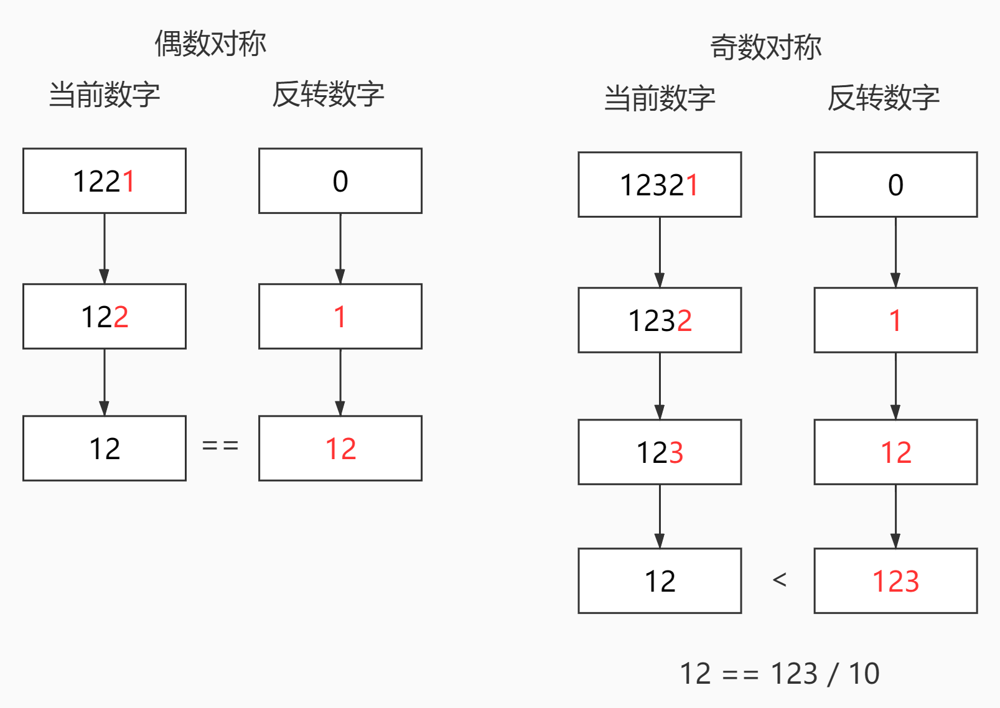

# <center>leetcode problem 9. 回文数</center>

## 链接

https://leetcode-cn.com/problems/palindrome-number/


## 题目描述

给你一个整数 x ，如果 x 是一个回文整数，返回 true ；否则，返回 false 。

回文数是指正序（从左向右）和倒序（从右向左）读都是一样的整数。例如，121 是回文，而 123 不是。

 

示例 1：

输入：x = 121
输出：true
示例 2：

输入：x = -121
输出：false
解释：从左向右读, 为 -121 。 从右向左读, 为 121- 。因此它不是一个回文数。
示例 3：

输入：x = 10
输出：false
解释：从右向左读, 为 01 。因此它不是一个回文数。
示例 4：

输入：x = -101
输出：false


提示：

-231 <= x <= 231 - 1


## 解法

### 1.

首先负数肯定不是回文数字，因为有一个负号。然后个位数为0的数字除了0本身肯定也不是回文数字，因为没有前导的0可以匹配。剩下的情况我们使用反转的方式来处理。反转数字的一半，每次遍历对10取模获得当前数字的个位数，将其累加在反转的数字中，然后当前数字除以10，继续下次遍历。当反转的数字大于或者等于当前数字的时候，表示已经正好反转了一半或者超过一半，停止遍历，判断当前数字和反转数字是否相等(偶数对称情况)或者当前数字是否等于等于反转数字除以10(奇数对称情况)。只反转一半的数字，而不是反转全部数字的方法，可以天然的不用处理数值溢出的情况。



#### 代码

```c++
class Solution
{
public:
    bool IsPalindrome(int x) 
    {
        if (x < 0 || (x % 10 == 0 && x != 0))
        {
            return false;
        }

        int half = 0;
        while (x > half)
        {
            half = half * 10 + x % 10;
            x /= 10;
        }

        return x == half || x == half / 10;
    }
};
```

