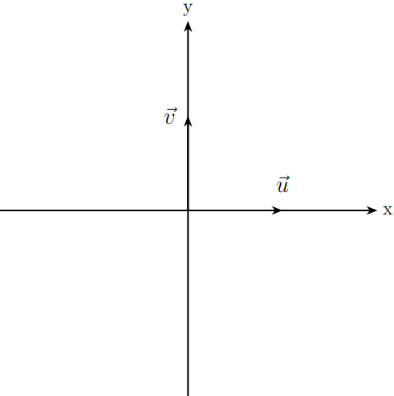
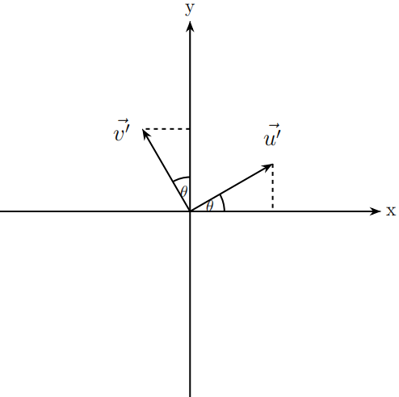

# 二维旋转矩阵推导
假设在一个二维坐标系中，有两个向量 $\vec{u}$ = $\begin{bmatrix}1 \\ 0\end{bmatrix}$，$\vec{v}$ = $\begin{bmatrix}0 \\ 1\end{bmatrix}$

&nbsp;

&nbsp;
假设以逆时针为正数旋转方向，将向量 $\vec{u}$ 和 $\vec{v}$ 分别旋转 $\theta$ 角度，得到两个新的向量 $\vec{u^{\prime}}$ 和 $\vec{v^{\prime}}$
&nbsp;

&nbsp;
根据三角函数的公式，可以很轻松的计算出这两个新向量的值，$\vec{u^{\prime}}$ = $\begin{bmatrix}cos\theta \\ sin\theta\end{bmatrix}$，$\vec{v^{\prime}}$ = $\begin{bmatrix}-sin\theta \\ cos\theta\end{bmatrix}$
假设该变换矩阵为 ${T}$ =  $\begin{bmatrix}A&B \\ C&D\end{bmatrix}$，那么 ${T}\times\vec{u}=\vec{u^{\prime}}$，即 $\begin{bmatrix}A&B \\ C&D\end{bmatrix}\begin{bmatrix}1 \\ 0\end{bmatrix}=\begin{bmatrix}cos\theta \\ sin\theta\end{bmatrix}$，根据矩阵乘法可以的得到两个等式，$A\times1+B\times0=\cos\theta$，$C\times1+D\times0=\sin\theta$，由此可以得到$A=cos\theta$，$C=sin\theta$。
同理 ${T}\times\vec{v}=\vec{v^{\prime}}$，即 $\begin{bmatrix}A&B \\ C&D\end{bmatrix}\begin{bmatrix}0 \\ 1\end{bmatrix}=\begin{bmatrix}-sin\theta \\ cos\theta\end{bmatrix}$，也可以得出两个等式，$A\times0+B\times1=-sin\theta$，$C\times0+D\times1=cos\theta$，$B=-sin\theta$，$D=cos\theta$。
所以二维旋转矩阵为 $T_{(\theta)}$ = $\begin{bmatrix}cos\theta&-sin\theta \\ sin\theta&cos\theta\end{bmatrix}$，$\theta$为旋转角度。